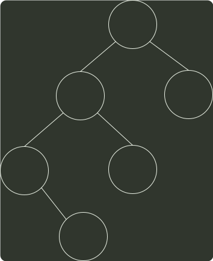

# q05_数据结构

## 📋 题目要求 (题面)

已知一棵二叉树的树形如图，若其后序遍历为 f,d,b,e,c,a，则其先序序列为（ ）。

- **A.** aedfbc
- **B.** acebdf
- **C.** cabefd
- **D.** dfebac

---

## 💡 答案与深度解析

**【正确答案】**：`A`

**正确答案：A**

如下图所示。对于后序序列 fdbeca，a 为树节点的根，因此在序号 1 中，a 首先进行绘制。同时，a 节点的左子树有 4 个节点，右子树有 1 个节点，因此 fdbe 属于左子树，c 节点属于右子树，所以我们在序号 2 的树中，填充 c。a 结点左子树的后序遍历序列为 fdbe，代表 e 为左子树的根节点，因此在序号 3 的树中，填充 e。同理 e 节点的左子树有两个节点，右子树有一个节点，因此 fdb 属于左子树，e 属于右子树，在序号 4 的树中，我们填写 b。e 的左子树的后序遍历序列为 fd，则 d 为子树的根节点，因此在序号 5 的树中，我们填充 d，最后在序号 6 的图中，填充 f。先序序列为 a，e，d，f，b，c。本题答案选 A。

a
