# q41_数据结构

## 📋 题目要求 (题面)

已知有向图 G 采用邻接矩阵存储，类型定义如下：

```c
typedef struct {                    // 图的类型定义
    int numVertices, numEdges;      // 图中顶点数和有向边数
    char VerticesList[MAXV];        // 顶点表，MAXV 为已定义常量
    int Edge[MAXV][MAXV];           // 邻接矩阵
} MGraph;
```

将图中出度大于入度的顶点称为 K 顶点。例如在题 41 图中，顶点 a 和 b 都是 K 顶点。

设计算法 `int printVertices(MGraph G)` 对给定任意非空有向图 G，输出 G 中所有 K 顶点的算法，并返回 K 顶点的个数。

(1) 给出算法的设计思想。

(2) 根据算法思想，写出 C/C++ 描述，并注释。




---

## 💡 答案与深度解析

1）采用邻接矩阵表示有向图时，一行中 1 的个数为该行对应顶点的出度，一列中 1 的个数为该列对应顶点的入度。使用一个初值为 0 的计数器记录 K 顶点的个数。对图 G 的每个顶点，根据邻接矩阵计算其出度 outdegree 和入度 indegree。若 outdegree - indegree > 0，则输出该顶点且计数器加 1。最后返回计数器的值。

2）算法实现

```c
int printVertices(MGraph G) {
    // K 顶点的个数
    int count = 0;
    for (int v = 0; v < numVertices; v++) {
        // v 顶点的入度和出度
        int indegree = 0;
        int outdegree = 0;
        // 统计出度
        for (int i = 0; i < numVertices; i++) {
            outdegree += G.Edge[v][i];
        }
        // 统计入度
        for (int i = 0; i < numVertices; i++) {
            indegree += G.Edge[i][v];
        }
        if (outdegree > indegree) {
            printf(&#34;%s &#34;, G.VerticesList[v]);
            count++;
        }
    }
    return count;
}
```
