# q07_数据结构

## 📋 题目要求 (题面)

一棵二叉搜索树如下图所示，K1、K2、K3 分别是对应结点中保存的关键字、三角形表示子树。则子树 T 中任一结点中保存的关键字 X 满足的是（ ）。

- **A.** $X<K_{1}$
- **B.** $X>K_{2}$
- **C.** $K_{1}$
- **D.** $K_{3}$

---

## 💡 答案与深度解析

**【正确答案】**：`D`

**正确答案：D**
根据二叉搜索树的性质，
 $K_{2}$
的左子树的节点关键字均小于
 $K_{2}$
，可以得出
 $K_{3}$ <K2
，
 $T$
中所有节点小于
 $K_{2}$
，同理也可以得出
 $K_{3}$
的右子树节点均大于
 $K_{3}$
，即
 $T$
中所有节点
 $>K_{3}$
，
 $X$
是
 $T$
中节点，由此可以得出
 $K_{3}$ <X<K2
。
