# q09_数据结构

## 📋 题目要求 (题面)

已知关键字序列 28, 22, 20, 19, 8, 12, 15, 5 是大根堆（最大堆），对该堆进行两次删除操作后，得到的新堆是（ ）。

- **A.** 20, 19, 15, 12, 8, 5
- **B.** 20, 19, 15, 5, 8, 12
- **C.** 20, 19, 12, 15, 8, 5
- **D.** 20, 19, 8, 12, 15, 5

---

## 💡 答案与深度解析

**【正确答案】**：`B`

**正确答案：B**

本题考察 堆的删除操作，先根据初始序列建堆，然后依次删除堆项元素，过程如下图：

28
