# q33_计算机网络

## 📋 题目要求 (题面)

若分组交换网络及每段链路的带宽如下图，则 H1 到 H2 的最大吞吐量约为（）。

- **A.** 1Mbps
- **B.** 10Mbps
- **C.** 100Mbps
- **D.** 1000Mbps

---

## 💡 答案与深度解析

**【正确答案】**：`B`

**正确答案：B**
H1 和 H2 两端的最大传输速率为 10Mbps，虽然中间的路由器最大传输速率为 1000Mbps,
但是根据网路最大流算法，HI 和 H2 的最大吞吐量等价于最大流，最大流为 1OMbps。
