# q37_计算机网络

## 📋 题目要求 (题面)

主机甲通过选择重传（SR）滑动窗口协议向主机乙发送帧的部分过程如下图所示。F 为数据帧，ACKx
为确认帧，x 是位数为比特的序号。乙只对正确接收的数据帧进行独立确认。发送窗口与接收窗口大小相
同且均为最大值。甲在
 $t_{1}$
时刻和
 $t_{2}$
时刻发送的数据帧分别是 ( )

- **A.** F1、F3
- **B.** F1、F4
- **C.** F3、F1
- **D.** F4、F1

---

## 💡 答案与深度解析

**【正确答案】**：`D`

**正确答案：D**
在
 $t_{1}$
时刻主机甲接收到了主机乙发送的 ACKO，暂时没有出错的帧，所以继续发送下一
个数据帧 F4。在
 $t_{2}$
时刻主机甲收到了 F1 超时的错误，根据 选择性重传，发送方只需要重传出错的帧，而不是所有的帧，所以只需要重新发送 F1。
