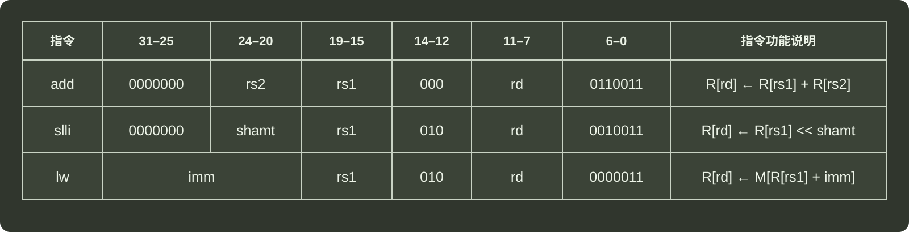
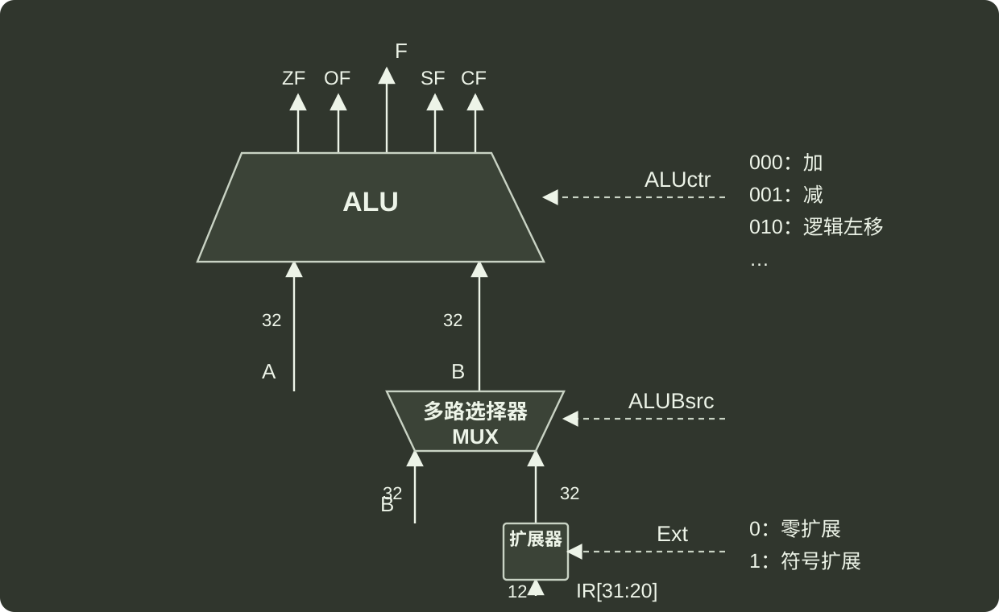

# q43_计算机组成原理

## 📋 题目要求 (题面)

假定计算机 M 字长为 32 位。按字节编址，采用 32 位定长指令字，指令 `add slli` 和 `lw` 的格式、编码和功能说明如题 43(a) 图所示。

其中 `R[x]` 表示通用寄存器 `x` 的内容，`M[x]` 表示地址为 `x` 的存储单元内容，`shamt` 为移位位数，`imm` 为补码表示的偏移量。题 43(b) 图给出了计算机 M 的部分数据通路及其控制信号（用箭头虚线表示），其中，`A` 和 `B` 分别表示从通用寄存器 `rs1` 和 `rs2` 中读出的内容，`IR[31:20]` 表示指令寄存器中的高 `12` 位。控制信号 `Ext` 为 0、1 时扩展器分别实现零扩展，符写扩展 `ALUctr` 为 000、001、010 时 ALU 分别实现加、减、逻辑左移运算。

请回答下列问题

(1) 计算机 M 最多有多少个通用寄存器？为什么 `shamt` 字段占 5 位？（2 分）

(2) 执行 `add` 指令时，控制信号 `ALUBsrc` 的取值应该是什么？若 `rs1` 和 `rs2` 寄存器内容分别是 `8765 4321H` 和 `9876 5432H`，则 `add` 指令执行后，`ALU` 输出端 `F`、`OF` 和 `CF` 的结果分别是什么？若设 `add` 指令处理的是无符号整数，则应根据哪个标志判断是否溢出（3 分）

(3) 执行 `slli` 指令时，控制信号 `Ext` 的取值可以是 0 也可以是 1，为什么？（2 分）

(4) 执行 `lw` 指令时，控制信号 `Ext`、`ALUctr` 的取值分别是什么？（2 分）

(5) 若一条指令的机器码是 `A040 A103H`，则该指令一定是 `lw` 指令，为什么？(2 分）

(6) 若执行该指令时，`R[01H]=FFFF A2D0H`，则所读取数据的存储地址是多少？(2 分）







---

## 💡 答案与深度解析

1）从 43 题 (a) 图可以看到，Y 寄存器 rs1 和 rs2 用 5 位表示，所以计算机 M 最多的是 2⁵=32 个寄存器。根据指令 `R[rd] ← [rs1] << shamt` 可知，shamt 表示左移。

shamt：计算机的机器字长是 32 位，所以 shamt 表示左移的最大范围不能超过 32，所以只需要
5bit 就可以表示对应的范围：
 $log_{2}$ 32=5
。

2）ALUBsrc = 0，它的作用是支持 lw 指令和 imm 的偏移（`R[rd] ← M[R[rs1]+imm]`）

F 的计算如下：

```c
8765 4321
+ 9876 5432
------------
 11FDB 9753
```

由于计算机的机器字长是 32 位，所以最高位的 1 舍掉，F = 1FDB 9753H:

OF 是溢出位，我们计算的结果发现确实发生了溢出和进位，所以 OF=1。

CF 是进位位，计算时发现了最高位有进位，所以 CF=1。

溢出的判断方法是，最高位进位（异或）次高位，计算过程发现最高位进位，次高位没有进位，所以 CF 是标志判断是否溢出。

3）slli 代表左移指令，slli 指令的高 12 位（即 IR[31:20]）的最高位为 0，因此无论进行零扩展还是符号扩展，都是在高位补 0，效果等价，因此 Ext 可以是 0 也可以是 1。

4）`R[rd] ← M[R[rs1]+imm]` 这条指令的意思是，rs1 里的内容加上立即数，等于真正要访问的内存地址。

计算偏移地址，偏移地址可正可负，应该使用补码表示。

所以是符号扩展，Ext=1，然后表示加法，所以根据 (b) 图可知 ALUctr=000。

5）A040 A103H = 1010 0000 0100 0000 1010 0001 0000 0011B，60 位 = 0000011，中间的 1412 位 = 010，
最高的 12 位为 A04H。其他两个指令 add 和 slli 的高 12 位都是 000H，所以该指令一定是 lw 指令。

6）A040 A103H = 1010 0000 0100 0000 1010 0001 0000 0011B，60 位 = 000 0011，中间的 1412 位 = 010，
最高的 12 位为 A04。imm 是 31~25，也就是 A404 组（注意是符号扩展）

扩展完 1111 1111 1111 1111 1111 1010 0000 0100，十六进制是 FFFF FA04。rs1 里的内容加上立即数，等于真正要访问的内存地址，R[O1H]=FFFF A2DOH，所以 FFFFFA04 + FFFFA2D0 = FFFF9CD4H。
