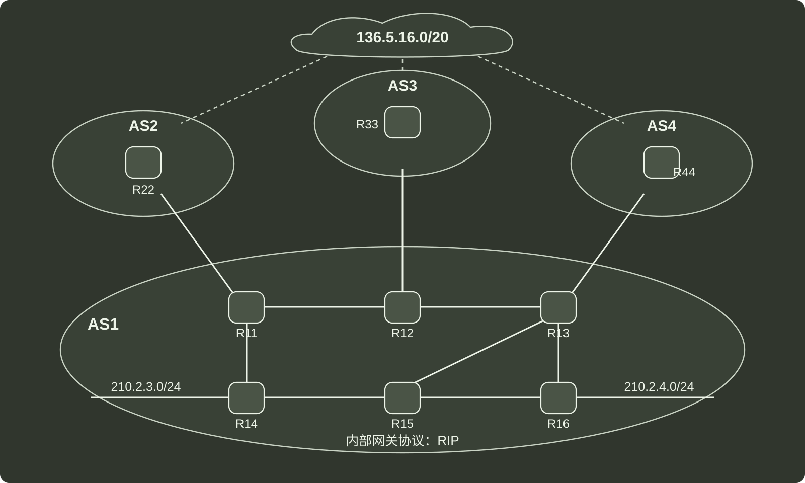

# q47_计算机网络

## 📋 题目要求 (题面)

网络空间是继陆海空地之后的"第五疆域"，网络技术是网络疆域建设与治理的基础。路由算法与协议是网络核心技术之一。对其准确认知，合理选择与应用，对网络建设十分重要。假设现有互联网中的 4 个自治系统互连拓扑示意图如题 47 图所示。其中，AS1 运行内部网关协议 RIP；AS3 规模较小，自治系统内任意两个主机间通信，经过路由器数不超过 15 个；AS4 规模较大，自治系统内任意两个主机间通信，经过路由器数量可能超过 20 个。

请回答下列问题：

（1）若仅有 RIP 和 OSPF 内部网关协议供选择，则 AS4 应选择哪个协议？（1 分）

（2）若 AS3 中的某主机向本自治系统另一主机发送 1 个 IP 分组，为确保该 IP 分组能正常接收，则该 IP 分组的初始 TTL 值应至少设置为多少？（1 分）

（3）设 AS1 中的路由器同一时刻启动，启动后立即构建并交换初始距离向量，之后，每隔 30s 交换一次最新的距离向量。则从交换初始距离向量时刻算起，R11~R16 路由器均获到达网络 210.2.4.0/24 的正确路由，至少需多长时间？（2 分）

（4）R44 向 R13 通告到达网络 136.5.16.0/20 路由时，由 BGP 协议哪类会话完成？通过哪个 BGP 报文通告？R13 通过 BGP 协议的哪类会话将该网络可达性信息通告给 R14 和 R15?（3 分）

（5）若 R14 和 R15 均收到分别由 R11、R12、R13 通告的到达网络 136.5.16.0/20 的可达性信息为：

目的网络：136.5.16.0/20，AS 路径：AS2 AS8 AS19，下一跳：R11

目的网络：136.5.16.0/20，AS 路轻：AS3 AS7 AS11 AS19，下一跳：R12

目的网络：136,5.16.0/20，AS 路径：AS4 AS10 AS19，下一跳：R13

则在无策略约束情况下，R14 和 R15 更新路由表后，各自路由表中到达网络 136.5.16.0/20 路由的下一跳分别是什么（用路由器名称表示）?（2 分）

---

## 💡 答案与深度解析

1）AS4 应选择 OSPF 协议。理由：

RIP（Routing Information Protocol）采用 跳数（hop count）作为度量标准，最大跳数限制为 15，超过 15 跳的网络将被视为不可达。因此，AS4 内部通信可能超过 20 个路由器的情况下，RIP 不能正常工作。OSPF（Open Shortest Path First）采用 链路状态路由，支持大规模网络，并且没有严格的跳数限制，适合规模较大的自治系统（如 AS4）。

因此，AS4 应选择 OSPF 作为内部网关协议。

2）应该被设置为 16。

AS3 内部任意两个主机之间通信，最多需要经过 15 个路由器。

TTL（Time To Live）值在每经过一个路由器时减 1，若 TTL 变为 0，分组将被丢弃。因此，为了确保 IP 分组能够到达目标主机，初始 TTL 至少应设置为 16，这样即使经过 15 个路由器，TTL 仍剩 1，可以成功到达目标主机。

3）AS1 运行的是 RIP（Routing Information Protocol），采用 距离向量路由算法，每 30 秒 交换一次最新的距离向量，并使用 逐跳扩散（Bellman-Ford 算法）更新路由表。

假设网络 210.2.4.0/24 最初只被某个路由器（如 R1）知道，其他路由器需要逐步学习该路由信息。

每次 RIP 更新，信息只能传播 1 跳，即相邻路由器在下一次交换后获得该路由。

直到 R11~R16 均获得正确路由时，最好情况下至少需要经历 2 跳（从 R14 出发，经过 2 个周期传播至每个路由器）。

每次传播耗时 30 秒，则 2 跳需要 2 × 30 = 60 秒。

4）如果路由器属于不同的自治系统，它们之间运行 eBGP（External BGP）进行路由通告。
如果路由器属于同一个自治系统，它们之间运行 iBGP（Internal BGP）来传播外部学到的 BGP 路由信息。

在 BGP 中，路由更新信息使用 UPDATE（更新）报文 进行通告，包含 网络前缀（136.5.16.0/20）及其路径属性（如 AS Path、下一跳等）。

R44 → R13：通过 eBGP 会话，使用 UPDATE 报文通告路由信息。

R13 → R14, R15：通过 iBGP 会话，使用 UPDATE 报文通告路由信息。

5）在 BGP（边界网关协议）中，默认情况下，路由选择遵循以下决策过程（无策略约束时）：

最短 AS 路径优先（首要准则）：BGP 会优先选择 AS 路径最短 的路由。若 AS 路径相同，则选取最小的下一跳路由 ID（RID）或基于其他 BGP 规则。

分析 R14 和 R15 的可选路由：

| 下一跳 | AS 路径 | 路径长度 |
| --- | --- | --- |
| R11 | AS2 AS8 AS19 | 3 |
| R12 | AS3 AS7 AS11 AS19 | 4 |
| R13 | AS4 AS10 19 | 3 |

R11 和 R13 的 AS 路径长度均为 3，比 R12（路径长度 4）更短，因此 R12 的路由会被排除。

R14 离 R11 更近，R15 离 R13 更近。
所以 R14 的下一跳为 R11，R15 的下一跳为 R13。
