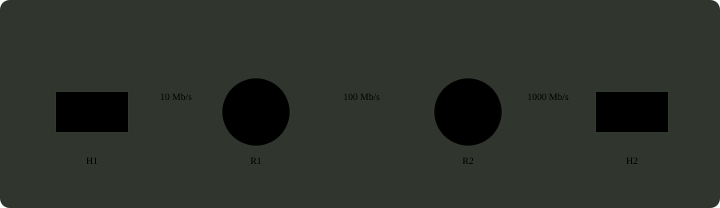

# q33_计算机网络

## 📋 题目要求 (题面)

如下图所示，主机 H1 向 H2 发送一个 2MB（1MB =
 $106$
B）文件有三种方式：① 电路交换，建立时间为 32us，速度为 10Mbps；② 分组交换，分组长度为 400B，忽略首部；③ 报文交换。电路交换的时间为
 $Tcs$
，报文交换的时间为
 $Tms$
，分组交换的时间为
 $Tps$
，则三者的大小关系是（ ）。

- **A.** $Tcs$
- **B.** $Tms$
- **C.** $Tms$
- **D.** $Tps$

---

## 💡 答案与深度解析

**【正确答案】**：`B`

**正确答案：B**

参考 传输时间计算：

电路交换的时间
 $Tcs$
= 连接建立时间 + 数据传输时间 = 32us + 2MB / 10Mbps报文交换的时间
 $Tms$
= 各链路传输时间之和 = 2MB/10Mbps + 2MB/100Mbps + 2MB/1000Mbps分组交换的时间
 $Tps$
= 考虑分组传输 overlap 的时间 = 2MB/10Mbps + 400B/100Mbps + 400B/1000Mbps

经计算可知
 $Tms$ >Tps>Tcs
。
