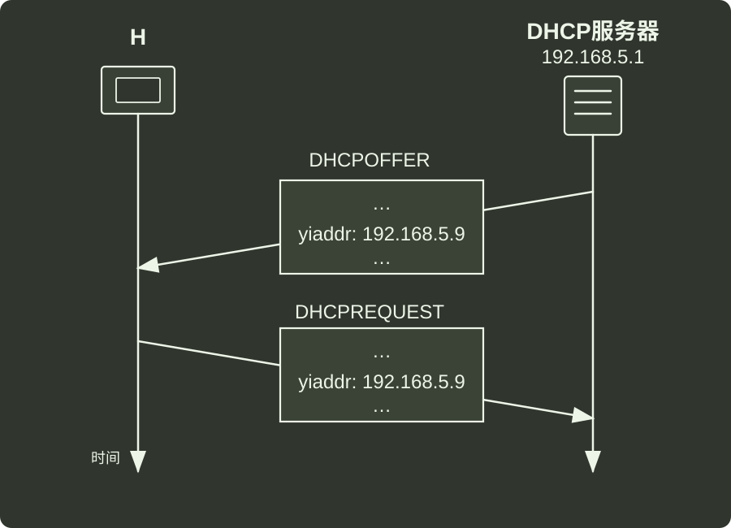

# q36_计算机网络

## 📋 题目要求 (题面)

一台新接入网络的主机 H 通过 DHCP 服务器动态请求 IP 地址过程中，与 DHCP 服务器交换 DHCP 报文过程如下图所示。封装 DHCP 的 REQUEST 报文的 P 数据报的目的 IP 地址和源 IP 地址分别是（ ）。

- **A.** 192.168.5.1, 0.0.0.0
- **B.** 192.168.5.1, 192.168.5.9
- **C.** 255.255.255.255, 0.0.0.0
- **D.** 255.255.255.255, 192.168.5.9

---

## 💡 答案与深度解析

**【正确答案】**：`C`

**正确答案：C**

DHCP 的 REQUEST 报文：

目的 IP 地址：DHCP 服务器的 IP 地址或者广播地址（255.255.255.255），因为主机可能不知道 DHCP 服务器的确切 IP 地址，尤其是在初始请求阶段，广播地址确保网络中的所有 DHCP 服务器都能接收到请求。

源 IP 地址：0.0.0.0，因为主机还未获得正式的 IP 地址，在这个阶段它使用 0.0.0.0 作为源地址来表示“没有 IP 地址”。
