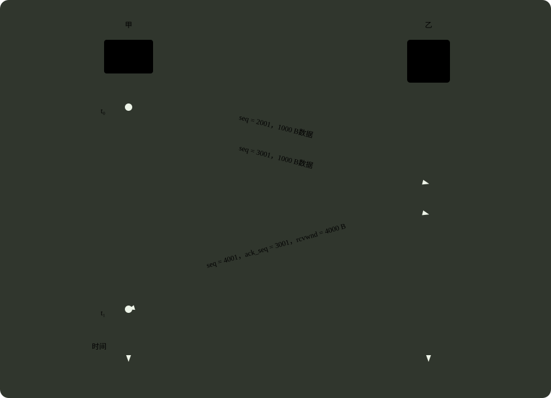

# q38_计算机网络

## 📋 题目要求 (题面)

主机甲通过 TCP 向主机乙发送数据的部分过程如下图，seq 为序号，ack-seq 为确认序号，rcwnd 为接收窗口。甲在
 $t_{0}$
时刻的拥塞窗口和发送窗口均为 2000B，拥塞控制阈值为 8000B，MSS=1000B。甲始终以 MSS 发送 TCP 段。若甲在
 $t_{1}$
时刻收到如图所示的确认段，则甲在未收到新的确认段之前，还可以继续向乙发送的 TCP 段数是（ ）。

- **A.** 2
- **B.** 3
- **C.** 4
- **D.** 5

---

## 💡 答案与深度解析

**【正确答案】**：`A`

**正确答案：A**

发送窗口取拥塞窗口和接收窗口之间的较小值，即 swnd = min(cwnd, rwnd)。

根据 ack_seq = 3001 可知，目前乙已经接收到了 1000B 的数据即一个 1 个 MSS，seq = 3001 的 MSS 仍然在发送中，并且此时乙的接收窗口（swnd）为 4 个 MSS。

此外，由于甲目前仍然在慢开始阶段（发送窗口没有达到阈值），所以接收到乙的确认后，拥塞窗口要 +1，此时 cwnd = 3 MSS。

所以发送窗口 swmd = min(3, 4) = 3 MSS。

另外需要注意这个公式：

发送窗口 的大小（swnd） = 已经发送但还没有确认数据（inflight） + 还没有发送的数据。这一题问的是甲还可以向乙发送多少个 TCP 段，这要减去那些之前已经发送但还没有确认的数据（1 MSS）。

所以还可以发送 3 - 1 = 2 MSS，答案选择 B。
