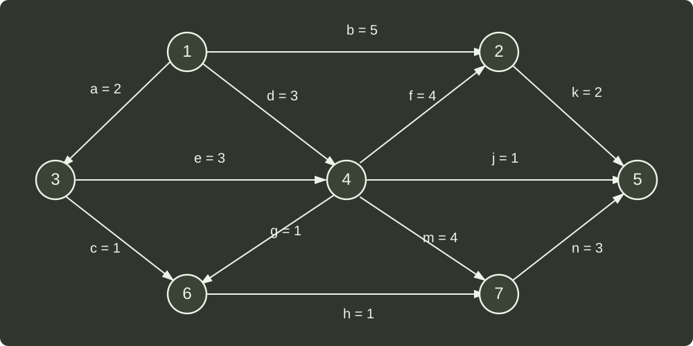

# q42_数据结构

## 📋 题目要求 (题面)

AOE 网，描述 12 个工程活动及持续时间

(1) 完成该工程的最短时间是多少？哪些是关键活动？

(2) 若以最短时间完成工程，则与活动 e 同时进行的活动可能有哪些？

(3) 时间余量最大的活动是哪个？其时间余量是多少？

(4) 假设工程从时刻 0 启动，因某种原因，活动 b 在时刻 6 开始，为保证工程不延期，在其它活动持续时间保持不变的情况下，b 的持续时间最多是多少？若不改变 b 的持续时间，则压缩哪个活动的持续时间也能保证工程不延期？

---

## 💡 答案与深度解析

1）首先计算最早发生时间 ve：

| node | 1 | 2 | 3 | 4 | 5 | 6 | 7 |
| --- | --- | --- | --- | --- | --- | --- | --- |
| ve | 0 | 9 | 2 | 5 | 12 | 6 | 9 |

然后计算最晚发生时间：

| node | 1 | 2 | 3 | 4 | 5 | 6 | 7 |
| --- | --- | --- | --- | --- | --- | --- | --- |
| vl | 0 | 10 | 2 | 5 | 12 | 8 | 9 |

ve 和 vl 相同的顶点为 1、3、4、7、5，所以关键活动为 a、e、m、n。

2）e 的执行时间是 2~5，可以与 e 同时执行的活动为 b、d、c。

3）假设有顶点 i→j 的活动（边），则该活动的 时间余量 = vl(j) - ve(i) - 边的长度。

计算所有非关键路径上活动的时间余量，可以得到活动 j 的时间余量是最大的，为 vl(5) - ve(4) - 1 = 6。

4）为保证 1 → 2 → 5 的路径长度不超过关键路径的长度，需要保证 6 + b + k ≤ 12，所以 b ≤ 4，即 b 的持续时间最长为 4。如果想要保证 b 仍然为 5 的话，需要压缩 k 的时间长度，将 k 缩小为 1。
