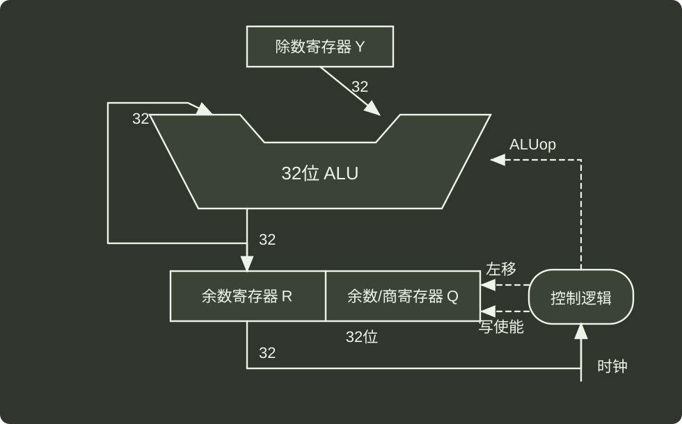

# q44_计算机组成原理

## 📋 题目要求 (题面)

接上题，R0~R4 为通用寄存器，SEXT 表示按符号扩展，M 中补码除法器，逻辑结构图如下：

机器级代码：

```c
// x 在 R2 中，i 在 R4 中
// 数组 d 的首地址在 R3 中
mov R1,(R3+R4*4) // R1 ← d[i]
scov R1          // {R0,R1} ← SEXT(R1)
idiv R1          // R1<-({R0,R1}/R2)
```

(1) 若执行 idiv 指令时，d[i]=0x87654321，x=0xff，则补码除法器中 R、Q、Y 的初始值分别为多少（用十六进制表示）？
图 b 中哪个部分包含计数器？在补码除法器执行过程中，ALUop 所控制的 ALU 运算有哪几种？

(2) 假设 idiv 执行过程中会检测并触发除法异常，则执行 idiv 指令时，哪些情况下会发生除法异常（要求给出此时 d[i] 和 x 的十六进制机器数）。发生除法异常时，在异常响应过程中，CPU 需要完成哪些操作？



---

## 💡 答案与深度解析

**【答案】**

1）R 中的值为 0xffffffff，Q 中的值为 0x87654321，Y 中的值为 0x000000ff。b 中的控制逻辑包含计数器，ALUop 所控制的 ALU 运算包含加法和减法。

2）第一种情况除数为 0 异常，d[i] 为任意值，x 为 0x00000000。第二种情况溢出异常，d[i] 为 0x80000000，x 为 0xffffffff，在 d[i] = -2³¹、x = -1 的情况下会发生溢出异常。

在发生除法异常时 CPU 响应的操作：

关中断，修改 CPU 状态为内核态。保存断点（PC 和 PSWR 中的值）。跳转到异常处理程序。

**【解析】**

1）**寄存器初始值分析**

**被除数**: `d[1] = 0x87654321` 是 32 位补码，最高位为 1（符号位），经 `sccv` 符号扩展为 64 位，高 32 位为 `0xFFFFFFFF`，低 32 位为 `0x87654321`。**除法器结构**: 余数寄存器 **R**（高 32 位）和商寄存器 **Q**（低 32 位）组成 64 位被除数，除数寄存器 **Y** 存储除数。**初始值**:**R**: 被除数高 32 位 → `0xFFFFFFFF`**Q**: 被除数低 32 位 → `0x87654321`**Y**: 除数 `x = 0xff` → `0x000000FF`（这里虽然只用了 8 位，但是表示的意思是 255，最高位不是符号位）

**计数器位置**

图中控制逻辑模块包含计数器 **C**，用于控制除法迭代次数（32 次，对应 32 位前）。

**ALU 运算类型**

补码除法采用加减交替法，ALU 需支持两种运算：

**减法**: `R - Y`（试减，判断余数符号）**加法**: `R + Y`（若余数为负，恢复余数）

2） **除法异常的情况**

除法异常包括 **除以 0** 和 **商溢出**：

**情况 1：除以 0**

当除数 `x = 0x00000000` 时，无论 `d[1]` 为何值，触发除以 0 异常。

**情况 2：商溢出**

32 位补码商的范围是 `[-2^31, 2^31 - 1]`。当 `d[1] = 0x80000000`（`-2^31`，32 位补码最小值）且 `x = 0xFFFFFFFF`（`-1`）时：商为 `(-2^31) / (-1) = 2^31`，超出 32 位补码最大值 `2^31 - 1`，触发商溢出异常。

**异常响应的 CPU 操作**

异常响应时，CPU 需完成以下核心步骤：

**保存现场**保存当前程序计数器 **PC**（下一条指令地址）、通用寄存器（或关键字寄存器）状态、程序状态字 **PSW**（含标志位）。**跳转异常处理**从中断向量表加载除法异常对应的服务程序入口地址，更新 **PC**。**模式切换与栈处理**若当前为用户态，切换至内核态，使用内核栈执行异常处理（避免用户栈破坏）。**中断控制**可选设置中断屏蔽位，防止嵌套异常干扰处理流程（视架构而定）。
