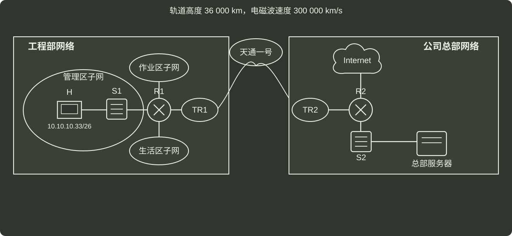

# q47_计算机网络

## 📋 题目要求 (题面)

(1) 忽略卫星信号中继，TR1，TR2 调制解调开销，则 R1 到 R2 之间的卫星链路单向传播时延是多少？主机 H 向总部服务器传输数据时可达到的最大吞吐量是多少？若忽略各层协议首部开销，以及以太网的传播时延，则 H → server 上传一个 4000B 的文件，至少需要多长时间？

(2) 基于 GBN 为卫星链路设计单向可靠的链路层协议 SLP，支持 R1 → R2 发送数据。SLP 数据帧长 1500B，忽略 ACK 帧长度，要求 SLP 单向信道利用率不低于 80%，则发送窗口至少为？SLP 帧序号至少为多少？

(3) 总部给工程部分配 IP 地址空间 10.10.10.0/24，再划分为 3 个子网：管理区子网、生活区子网、作业区子网。已知管理区子网地址为 10.10.10.33/26，若生活区子网不少于 120 个，作业子网、管理区子网 IP 均不少于 60 个，H 已正确配置 IP。请问作业区子网和生活区子网地址各是多少？

---

## 💡 答案与深度解析

1）计算卫星链路的单向传播时延：在忽略卫星信号中继、TR1、TR2 调制解调开销的情况下，R1 到 R2 之间的卫星链路单向传播时延主要取决于电滋波在太空中的传播速度以及卫星与地球之间的距离。卫星到地球表面的距离大约为 36000km。电磁滋波在太空中的传播速度接近光速，即约每秒 300000 公里。

因此，R1 和 R2 之间的卫星链路的 单向传播时延 可以计算为：时延 = 2×距离/速度 = 2×36000km/(300000km/s) = **0.24 秒**。

计算传播时延注意需要 × 2，因为需要通过卫星中转，首先地面 → 卫星，然后卫星 → 地面

计算主机 H 向总部服务器可达到的最大传输量：最大吞叶量与链路带宽和传播时延相关。在忽路一些开销的情况下，可以通过链路带宽和传播时延来计计算。一般公式为：

 $吞吐量=传播时延 +数据帧大小/链路带宽$ 数据帧大小
