# q36_计算机网络

## 📋 题目要求 (题面)

支持 VLAN 划分的以太网交换机，已按端口划分了两个 VLAN。VLAN 划分结果及各端口连接主机的 MAC 地址如图所示。下列具有不同目的 MAC 地址（DA）和源 MAC 地址（SA）的以太帧 F1–F4 中，H3 会接收到的是（ ）

F1: （DA）00-1A-2B-3C-4D-03；（SA）00-1A-2B-3C-4D-01
F2: （DA）00-1A-2B-3C-4D-04；（SA）00-1A-2B-3C-4D-05
F3: （DA）FF-FF-FF-FF-FF-FF；（SA）00-1A-2B-3C-4D-02
F4: （DA）00-1A-2B-3C-4D-06；（SA）00-1A-2B-3C-4D-03

- **A.** 仅 F2、F4
- **B.** 仅 F1、F3
- **C.** 仅 F1、F2
- **D.** 仅 F3、F4

---

## 💡 答案与深度解析

**【正确答案】**：`B`

**正确答案：B**

**【解析】**
**1. 主机和端口的对应关系**

**VLAN 1（左半部分）**端口范围：1–7、13–19H1 → 端口 13 → MAC **…-01**H2 → 端口 2 → MAC **…-02**H3 → 端口 5 → MAC …-03** ✅（我们关心的主机）**VLAN 2（右半部分）**端口范围：8–12、20–24H4 → 端口 8 → MAC **…-04**H5 → 端口 9 → MAC **…-05**H6 → 端口 12 → MAC **…-06**

👉 **H3 位于 VLAN 1 中。**

**2. 交换机与 VLAN 的转发规则**

**单播帧**仅在**源端口所属的 VLAN 内**查询 MAC 地址表并进行转发。若目的 MAC 地址不在本 VLAN 的地址表中，则**不会转发**该帧。**广播帧**仅在本 VLAN 内的所有端口（除源端口）进行广播**。**VLAN 间完全隔离**在没有三层设备的情况下，不同 VLAN 之间无法直接通信。

**3. 逐帧判断 H3 能否收到**

**F1**目的地址（DA）= …-03（H3）源地址（SA）= …-01（H1，属于 VLAN 1）分析：帧源自 VLAN 1，目的 MAC 地址正是 H3。属于同 VLAN 单播通信。✅ **H3 会接收此帧。**F2**目的地址（DA）= …-04（H4，属于 VLAN 2）源地址（SA）= …-05（H5，属于 VLAN 2）分析：整个帧的源和目的均位于 **VLAN 2** 内，该帧的通信被限制在 VLAN 2 中。❌ **H3 接收不到此帧。**F3**目的地址（DA）= FF-FF-FF-FF-FF-FF（广播地址）源地址（SA）= …-02（H2，属于 VLAN 1）分析：这是一个广播帧，且源位于 VLAN 1。广播范围仅限于 VLAN 1 内的所有端口（发送端口除外）。✅ **H3 位于 VLAN 1，因此会收到此广播帧。**F4**目的地址（DA）= …-06（H6，属于 VLAN 2）源地址（SA）= …-03（H3，属于 VLAN 1）分析：帧源自 VLAN 1，但目的 MAC 地址属于 VLAN 2。交换机在 VLAN 1 的 MAC 地址表中**查不到该目的地址**，且单播帧**不会跨 VLAN 进行泛洪**。❌ **H3 收不到此帧（实际上这是 H3 自己发出的帧）。**

**最终结论**

H3 能够接收到的帧是：

✅ **F1**✅ **F3**

对应选项为：**B 仅 F1、F3**
