# q37_计算机网络

## 📋 题目要求 (题面)

某网络在
 $t_{0}$
时刻的网络拓扑与
 $R_{1}$
的路由表如下图所示。
 $R_{1}$ ∼R4
为路由器，基于链路状态路由算法进行路由计算。
 $S_{0}$ ∼S4
为路由器
 $R_{1}$
的接口，链路上的数值为链路开销。若在
 $t_{1}$
（
 $t_{1}$ >t0
）时刻，
 $R_{1}$
检测到
 $R_{1}$
与
 $R_{2}$
之间的链路断开，则
 $R_{1}$
重新计算路由并进行充分路由聚合后，表中路由条目的数量为（ ）。

- **A.** 3
- **B.** 4
- **C.** 5
- **D.** 6

---

## 💡 答案与深度解析

**【正确答案】**：`B`

> 该文件为 legacy derived reference；正式心智模型题解见 [[solutions/q37|solutions/q37.md]]。

链路断开后先重新计算最短路，再执行题目要求的**充分路由聚合**。重新计算后 `199.10.20.0/27` 与 `199.10.20.32/27` 采用相同出口，且两段正好对齐为一个 `/26` 地址块，因此可聚合成 `199.10.20.0/26`。未聚合时的 5 条路由因此减少为 4 条，答案为 **B**。
