# q46_操作系统

## 📋 题目要求 (题面)

（本题满分 8 分）

文件系统的目录项包括文件名和索引节点号。磁盘包含索引节点表、位图、目录、文件数据等元数据。若盘块大小为 4 KB，盘块号占 4 B，索引节点表存放了系统的所有文件，从 0 开始编号，存放在盘块号 100 开始连续的 4096 个盘块中。索引节点占用 128 B，包含直接地址项 5 个，一级间接地址项、二级间接地址项、三级间接地址项各 1 个。磁盘位示图和索引节点位示图分别记录磁盘和索引节点的使用情况，0 表示未使用，1 表示已使用。其中目录结构图与文件的索引节点表如下所示（此处假定图中信息已给出），file 文件占 30 KB。

（1）file 的索引节点所在的盘块号是多少？若 file 的索引节点已经读取到内存，要访问 file 文件中偏移地址 21460 的一个字节数据，则最多需要读多少个盘块？如果文件系统中有足够的磁盘空间，则最多可以存放多少个文件？（3 分）

（2）如果要删除目录 dir1，则需要对元数据进行哪些操作？（5 分）

---

## 💡 答案与深度解析

（1）

文件的索引节点所在盘块号：
盘块大小为 4 KB，索引节点占用 128 B，每个盘块可存放
 $4096÷128=32$
个索引节点。
索引节点表从盘块号 100 开始，连续占用 4096 个盘块，索引节点从 0 开始编号。
对于索引节点号 1000，块内偏移为
 $1000÷32=31$
（余 8），因此 **盘块号为
 $100+31=131$
**。

访问偏移地址 21460 的一个字节最多需要读的盘块数：
盘块大小为 4 KB，逻辑块号为
 $⌊21460÷4096⌋=5$
，块内偏移为
 $21460mod$ 4096=980
。
索引节点有 5 个直接地址项（对应逻辑块号 0～4），逻辑块号 5 需通过一级间接地址项访问。
索引节点已在内存，但一级间接块需从磁盘读取，再读取数据块，因此 **最多需要读 2 个盘块**（一级间接块和数据块）。

最多可存放的文件数：
索引节点表占用 4096 个盘块，每个盘块含 32 个索引节点，因此索引节点总数为
 $4096\times 32=131072$
。
每个文件（含目录）占用一个索引节点，故 **最多可存放 131072 个文件**。

（2）
删除目录 dir1（非空）需递归删除其下文件 file，再删除自身，对元数据的操作包括：

删除文件 file：根据 file 的索引节点（节点号 1000）释放其占用的所有数据块（包括直接块、间接块及间接块本身），在磁盘位示图中将对应位清零。在索引节点位示图中将节点 1000 对应位清零。修改 dir1 的目录数据块，删除 file 的目录项。删除目录 dir1：释放 dir1 目录文件占用的数据块（存放目录项的数据块），在磁盘位示图中将对应位清零。在索引节点位示图中将 dir1 的索引节点（节点号 201）对应位清零。修改父目录 dir 的目录数据块，删除 dir1 的目录项。
