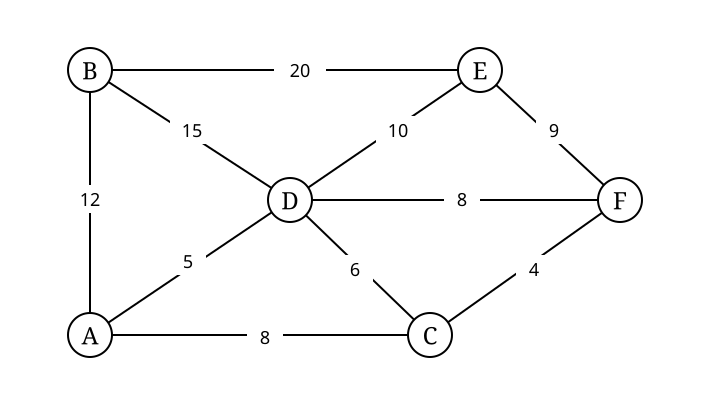

# 03｜图的表示、遍历与结构算法｜选择题

> 来源题号：127–170  
> Q148、Q157 的图已重建为可编辑 TikZ/SVG。

[查看答案与逐题解析](03_图表示遍历与结构算法_答案与解析.md)

## 图的基本性质与存储

### 127
一个有 28 条边的非连通无向图至少有（ ）个顶点。

A. 7  B. 8  C. 9  D. 10

### 128
以下关于图的叙述中，正确的是（ ）。

A. 图与树的区别在于图的边数大于等于顶点数  
B. 若 $G=(V,E)$，任取 $V'\subseteq V$、$E'\subseteq E$ 都能构成 $G$ 的子图  
C. 无向图的连通分量是无向图中的极大连通子图  
D. 图的遍历就是从图中某一顶点出发并访问图中其余所有顶点

### 129
对于一个有 $n$ 个顶点的图：若是连通无向图，其边数至少为（ ）；若是强连通有向图，则其边数至少为（ ）。

A. $n-1,n$  B. $n,n$  C. $n-1,n(n-1)$  D. $n,n(n-1)$

### 130
无向图 $G$ 有 23 条边，度为 4 的顶点有 5 个，度为 3 的顶点有 4 个，其余都是度为 2 的顶点，则图 $G$ 有（ ）个顶点。

A. 11  B. 12  C. 15  D. 16

### 131
在一个有 $n$ 个顶点、**无自环且无重边的简单有向图**中，一个顶点的总度（入度 + 出度）最大可达（ ）。

A. $n$  B. $n-1$  C. $2n$  D. $2n-2$

### 132
具有 6 个顶点的无向简单图，当有（ ）条边时能确保图一定连通。

A. 8  B. 9  C. 10  D. 11

### 133
下列关于图的存储结构的说法中，错误的是（ ）。

A. 不考虑压缩时，邻接矩阵所占空间只与顶点数有关，与边数无关  
B. 邻接表只用于有向图的存储，邻接矩阵适用于有向图和无向图  
C. 若一个有向图的邻接矩阵对角线以下元素全为 0，则该图存在拓扑序列  
D. 无向图邻接矩阵是对称的，可只存下三角或上三角部分

### 134
含有 $n$ 个顶点和 $e$ 条边的无向简单图，其邻接矩阵中零元素的个数为（ ）。

A. $e$  B. $2e$  C. $n^2-e$  D. $n^2-2e$

### 135
一个有 $n$ 个顶点的图用邻接矩阵 $A$ 表示。若图为有向图，顶点 $v_i$ 的入度是 ___；若图为无向图，顶点 $v_i$ 的度是 ___。

① $\sum_{i=1}^{n}A[i][j]$  
② $\sum_{j=1}^{n}A[j][i]$  
③ $\sum_{j=1}^{n}A[i][j]$  
④ $\sum_{j=1}^{n}A[j][i]$ 或 $\sum_{j=1}^{n}A[i][j]$

A. ②④  B. ①④  C. ③②  D. ③④

### 136
用有向无环图描述表达式 $(A+B)\times[(A+B)/A]$，若公共子表达式只保留一份，至少需要（ ）个顶点。

A. 5  B. 6  C. 8  D. 9

### 137
以下关于图的存储结构的叙述中，正确的是（ ）。

A. 一个图的邻接矩阵表示唯一，邻接表表示唯一  
B. 在顶点顺序固定时，一个图的邻接矩阵表示唯一，而邻接表中边结点次序可以不同  
C. 一个图的邻接矩阵表示不唯一，邻接表表示唯一  
D. 一个图的邻接矩阵表示不唯一，邻接表表示不唯一

### 138
矩阵 $A$ 是有向图 $G$ 的邻接矩阵，若矩阵 $A^2$ 的元素 $(A^2)_{ij}=3$，则说明（ ）。

A. 从顶点 $i$ 到 $j$ 存在 3 条长度为 2 的走步（walk）  
B. 从顶点 $i$ 到 $j$ 存在 3 条长度不超过 2 的路径  
C. 从顶点 $i$ 到 $j$ 存在 2 条长度为 3 的路径  
D. 从顶点 $i$ 到 $j$ 存在 2 条长度不超过 3 的路径

### 139
邻接表中有奇数个边表结点，则（ ）。

A. 图为无向图  B. 图为有向图  C. 图中有奇数个顶点  D. 图中有偶数个顶点

### 140
对邻接表的叙述中，（ ）是正确的。

A. 无向图的邻接表中，第 $i$ 个顶点的度为第 $i$ 个链表中结点数的两倍  
B. 邻接表比邻接矩阵的所有操作都更简便  
C. 邻接矩阵比邻接表的所有操作都更简便  
D. 若只建立有向图的出边邻接表，要得到某顶点的总度通常需要额外统计入边，可能遍历整个邻接表

### 141
下面说法错误的是（ ）。

A. 一个有 $n$ 个顶点和 $n$ 条边的无向图一定有环  
B. 建立十字链表和建立邻接表的时间复杂度通常可以认为相同量级  
C. 邻接表只能用于有向图的存储，邻接矩阵对有向图和无向图都适用  
D. 若应用中需要方便找到表示同一条无向边的两个边结点，邻接多重表比普通邻接表更合适

## DFS、BFS 与连通性

### 142
下列关于图的说法中，错误的是（ ）。

I. 对一个无向图进行 DFS 时，得到的深度优先遍历序列是唯一的  
II. 若有向图不存在回路，即使不用访问标志位，同一结点也不会被访问两次  
III. 采用 DFS 或拓扑排序可以判断有向图中是否有环  
IV. 对任何非强连通图必须调用 2 次或以上 BFS 才可访问所有顶点

A. I、II、III  B. II、III  C. I、II  D. I、II、IV

### 143
如果无向图 $G$ 必须经过两次广度优先搜索才能访问其所有顶点，则下列说法错误的是（ ）。

A. $G$ 肯定不是完全图  
B. $G$ 中一定有回路  
C. $G$ 一定不是连通图  
D. $G$ 有 2 个连通分量

### 144
考虑一个包含 $n$ 个顶点、$m$ 条边且没有自环的有向图 $G$。以下描述正确的是（ ）。

A. 如果 $G$ 的强连通分量数量等于 $n$，则 $m\ge n^2$  
B. 如果 $G$ 是一个有向树，则必有 $m=n-1$ 且必强连通  
C. 如果 $G$ 是强连通图，则 $m\ge n$  
D. 如果 $G$ 是有向完全图，则 $m=n(n-1)/2$

### 145
下列关于图的叙述，正确的是（ ）。

I. 强连通分量缩点后得到的有向图中，任意两个顶点之间都不存在有向边  
II. 在一个连通无向图中，顶点数为 $n$，其任一生成树的边数为 $n-1$  
III. 对于有向无环图，可以通过一次拓扑排序直接判断任意两个顶点之间是否有边  
IV. 在一个连通无向图中，若从任意顶点出发都能到达其他顶点，则这个图是“强连通”的

A. II  B. I、III  C. I、II、III  D. II、IV

### 146
对一个有 $n$ 个顶点、$e$ 条边的图采用邻接表表示时，进行 DFS 的时间复杂度为（ ），空间复杂度为（ ）；进行 BFS 的时间复杂度为（ ），空间复杂度为（ ）。

① $O(n)$  ② $O(e)$  ③ $O(n+e)$  ④ $O(1)$

A. ③①③①  B. ①①③①  C. ③①③④  D. ②①②①

### 147
无向图 $G$ 中包含 $N\ (N>15)$ 个顶点。邻接矩阵占 $N^2$ 个存储单元；邻接表中每个边表结点占 3 个存储单元，每个头结点占 2 个存储单元。若要求邻接矩阵所占空间小于邻接表所占空间，则图 $G$ 的边数至少是（ ）。

A. $N^2-3N$  
B. $(N^2-2N)/2$  
C. $(N^2-2N)/3$  
D. $\left\lfloor\dfrac{N^2-2N}{6}\right\rfloor+1$

### 148
如下图所示，在下面 5 个序列中，符合从顶点 `a` 开始的深度优先遍历的序列个数是（ ）。

1. `aebfdc`  
2. `acfdeb`  
3. `aedfcb`  
4. `aefdbc`  
5. `aecfdb`

A. 5  B. 4  C. 3  D. 2

### 149
邻接表存储的图，其深度优先遍历算法类似于树的（ ），广度优先遍历算法类似于树的（ ）。

① 中序遍历  ② 先序遍历  ③ 后序遍历  ④ 层次遍历

A. ①④  B. ②④  C. ③④  D. ②③

### 150
无向图 $G=(V,E)$，其中 $V=\{a,b,c,d,e,f\}$，$E=\{(a,b),(a,e),(a,c),(b,e),(c,f),(f,d),(e,d)\}$。对该图进行深度优先遍历，不能得到的序列是（ ）。

A. `acfdeb`  B. `aebdfc`  C. `aedfcb`  D. `abecdf`

### 151
无向图 $G=(V,E)$，其中 $V=\{a,b,c,d,e,f\}$，$E=\{(a,b),(a,e),(a,c),(b,e),(c,f),(f,d),(e,d)\}$。以顶点 `a` 为源点进行 BFS，得到的顶点序列正确的是（ ）。

A. `a,b,e,c,d,f`  
B. `a,c,f,e,b,d`  
C. `a,e,b,c,f,d`  
D. `a,e,d,f,c,b`

### 152
以下说法正确的是（ ）。

I. 用邻接表存储的图的 DFS 类似树的先序遍历；用邻接矩阵存储的图的 BFS 类似树的层次遍历  
II. 用邻接矩阵存储的图的 DFS 类似树的先序遍历；用邻接表存储的图的 BFS 类似树的层次遍历  
III. 从连通无向图任一顶点出发进行 DFS 或 BFS 均可访问所有顶点  
IV. 对非连通无向图做完整 DFS，外层启动 DFS 的次数等于连通分量数  
V. DFS 和 BFS 都可用于有向/无向、有权/无权图的结构遍历

A. 除 IV 以外  B. I、II、V  C. 除 V 以外  D. 全部正确

### 153
判断有向图中是否存在回路，除拓扑排序外，还可以利用（ ）。

A. 求关键路径的方法  B. Dijkstra 算法  C. 深度优先遍历算法  D. 广度优先遍历算法

## 最小生成树、最短路与拓扑

### 154
用 Prim 算法和 Kruskal 算法构造图的最小生成树，所得到的最小生成树（ ）。

A. 一定相同  B. 一定不同  C. 可能相同，也可能不同  D. 无法比较

### 155
设一个 $n$ 个顶点的带权连通图有 $e=\sqrt n\log_2 n$ 条边。按教材常见实现比较：Prim 采用邻接矩阵，时间复杂度为 $O(n^2)$；Kruskal 对边排序并配合并查集，时间复杂度为 $O(e\log e)$。则应优先选用（ ）算法求最小生成树。

A. Kruskal  B. Prim  C. Floyd  D. 拓扑排序

### 156
设有一个无向图 $G=(V,E)$ 和 $G'=(V,E')$，则以下关于生成树的说法错误的是（ ）。

A. 若 $G'$ 为 $G$ 的生成树，则 $E'\subseteq E$  
B. 若 $G'$ 为 $G$ 的生成树，则 $|E'|=|V|-1$  
C. 若 $G'$ 为 $G$ 的生成树，则 $G'$ 中每个顶点的度数均为 1  
D. 若 $G'$ 为 $G$ 的生成树，则 $G'$ 一定连通

### 157
存在一张无向带权图 $G$ 如图。现分别使用 Prim 和 Kruskal 求最小生成树，假设 Prim 从顶点 A 开始，则两个算法按各自接受边的先后顺序比较，处于相同序号位置的边共有（ ）条。

A. 1  B. 2  C. 3  D. 0

### 158
以下叙述中，正确的是（ ）。

A. 只要无向连通图中没有权值相同的边，则其最小生成树唯一  
B. 只要无向图中有权值相同的边，则其最小生成树一定不唯一  
C. 从 $n$ 个顶点的连通图中选取 $n-1$ 条权值最小的边，即可构成最小生成树  
D. 连通图 $G$ 的任意含 $n$ 个顶点、$n-1$ 条边的子图一定是 $G$ 的生成树

### 159
下列关于图的最短路径的相关叙述中，正确的是（ ）。

A. 在通常的有限最短路问题中，可取一条不重复顶点的简单路径作为最短路径  
B. Dijkstra 算法不适合求有回路的带权图的最短路径  
C. Dijkstra 算法不适合通过多次运行求任意两个顶点的最短路径  
D. Floyd 算法中第 $k-1$ 轮得到的一条具体最短路径一定作为边序列包含在第 $k$ 轮路径中

### 160
下列关于图的最短路径的叙述中，正确的是（ ）。

I. Dijkstra 算法求单源最短路径不允许出现负权边  
II. 用 Dijkstra 直接求每对顶点间最短路径的总时间复杂度恒为 $O(n^2)$  
III. Floyd 算法允许负权边，但要求相关最短路问题中不存在可达的负权回路

A. I、II、III  B. 仅 I  C. I、III  D. II、III

### 161
带权连通图 $G=(V,E)$，$V=\{v_1,v_2,v_3,v_4,v_5\}$，
$E=\{(v_1,v_2),(v_1,v_3),(v_1,v_4),(v_2,v_3),(v_2,v_4),(v_2,v_5),(v_3,v_4),(v_4,v_5)\}$，且每条边的权值等于其两个端点下标中较大的数字，则 $G$ 的最小生成树权值之和为（ ）。

A. 11  B. 12  C. 14  D. 15

### 162
下面的（ ）方法可以判断一个有向图是否有环。

I. 深度优先遍历  
II. 拓扑排序  
III. 求最短路径  
IV. 求关键路径的前置拓扑检查

A. I、II、IV  B. I、III、IV  C. I、II、III  D. 全部可以

### 163
用 DFS 遍历有向无环图，并在 DFS 算法退栈返回时打印相应顶点，则输出的顶点序列是（ ）。

A. 逆拓扑有序的  B. 拓扑有序的  C. 无序的  D. 仅按编号有序

### 164
下列关于拓扑排序的说法中，错误的是（ ）。

I. 若某有向图存在环路，则该有向图不存在拓扑排序  
II. 拓扑排序中暂存入度为 0 的顶点，可以使用栈，也可以使用队列  
III. 若有向图的拓扑序列唯一，则图中每个顶点的入度和出度最多为 1  
IV. 若有向图的拓扑序列唯一，则入度为 0 和出度为 0 的顶点都仅有 1 个

A. I、III、IV  B. III、IV  C. II、IV  D. III

### 165
若一个没有自环的有向图的顶点不能排成一个拓扑序列，则可以判定该有向图（ ）。

A. 含有多个出度为 0 的顶点  
B. 一定整体强连通  
C. 含有多个入度为 0 的顶点  
D. 含有顶点数大于 1 的强连通分量

### 166
下列关于图的说法中，正确的是（ ）。

I. 有向图中顶点 $V$ 的总度等于其邻接矩阵第 $V$ 行中 1 的个数  
II. 无向图的邻接矩阵一定对称，有向图的邻接矩阵一定非对称  
III. 带权图的最小生成树中，某条已选边的权值可能超过某条未选边的权值  
IV. 若 DAG 的拓扑序列唯一，则可以唯一确定该图的全部边

A. I、II、III  B. III、IV  C. III  D. IV

## 关键路径

### 167
关键路径是指在只有一个源点和一个汇点的有向无环网中，源点至汇点（ ）的路径。

A. 弧数最多  B. 弧数最少  C. 权值之和最大  D. 权值之和最小

### 168
下面关于求关键路径的说法中，不正确的是（ ）。

A. 求关键路径以拓扑排序为基础  
B. 一个事件的最早发生时间与以该事件为始点的活动的最早开始时间相同  
C. 一个事件的最迟发生时间是以该事件为尾的活动的最迟开始时间与该活动持续时间之差  
D. 任一活动持续时间的改变都有可能引起关键路径变化

### 169
下列关于关键路径的说法中，正确的是（ ）。

I. 改变网上某一关键路径上的任意一个关键活动后，必将产生不同的关键路径  
II. 在只有一条控制工期的关键路径且该活动仍保持关键的前提下，延长其关键活动会延长总工期  
III. 缩短关键路径上任意一个关键活动就一定能缩短总工期  
IV. 缩短所有关键路径共同包含的关键活动可缩短当前关键路径长度，并可能缩短工期  
V. 只要一个活动被多条关键路径共享，缩短它就一定能缩短总工期

A. II、V  B. I、II、IV  C. II、IV  D. I、IV

### 170
在求 AOE 网的关键路径时，若该有向图用邻接矩阵表示，约定 $\infty$ 表示无边，且第 $i$ 列除对角位置外均为 $\infty$，则（ ）。

A. 若关键路径问题满足单源约定，第 $i$ 个顶点一定是起点  
B. 第 $i$ 个顶点一定是终点  
C. 关键路径不存在  
D. 对应无向图一定有多个连通分量
