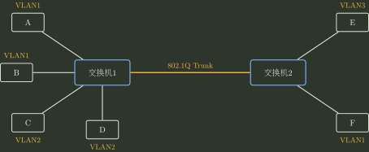
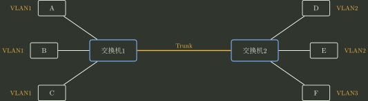

# 03｜数据链路层、可靠传输与介质访问｜选择题

> 来源题号：750–790

[查看答案与逐题解析](03_数据链路层_可靠传输与介质访问_答案与解析.md)

## 数据链路层服务、流量控制与差错控制

### 750

数据链路层协议的功能不包括（ ）。

A. 定义帧格式与边界  
B. 在具体协议中提供相邻结点之间的可靠传输  
C. 控制对共享物理传输介质的访问  
D. 为 IP 分组选择跨多个网络的端到端路由  

### 751

数据链路层为网络层提供的服务不包括（ ）。

A. 无确认的无连接服务  
B. 有确认的无连接服务  
C. 无确认的面向连接服务  
D. 有确认的面向连接服务  

### 752

对于信道比较可靠且对实时性要求高的网络，数据链路层采用（ ）比较合适。

A. 无确认的无连接服务  
B. 有确认的无连接服务  
C. 无确认的面向连接服务  
D. 有确认的面向连接服务  

### 753

流量控制实际上是对（ ）的控制。

A. 发送方的数据流量  
B. 接收方的数据流量  
C. 发送、接收方的数据流量  
D. 链路上任意两结点间的数据流量  

### 754

滑动窗口流控机制中，可直接传输而不需要事先确认的是（ ）。

A. 滑动窗口左边的数据  
B. 滑动窗口右边的数据  
C. 滑动窗口内的数据  
D. 滑动窗口收缩的数据  

### 755

流量控制是计算机网络中解决发送方和接收方传输速率不匹配的一项基本机制，实现这种机制所采取的措施是（ ）。

A. 增大接收方接收速度  
B. 减小发送方发送速度  
C. 接收方向发送方反馈信息  
D. 增加双方的缓冲区  

### 756

下列有关数据链路层差错控制的叙述中，错误的是（ ）。

A. 数据链路层只能提供差错检测，而不提供对差错的纠正  
B. 奇偶校验码只能检测出错误而无法对其进行修正，也无法检测出双位错误  
C. CRC 检验码可以检测出所有的单比特错误  
D. 海明码可以纠正一位差错  

### 757

假设通信双方使用字符填充法（数据由非 ASCII 码组成），SOH 和 EOT 是标志帧开始和结束的定界符，ESC 是用于填充的转义字符。若接收方收到序列：

```text
SOH ESC SOH ESC ESC ESC ESC ESC SOH EOT
```

则发送方发送的原始数据（不包括帧定界符）为（ ）。

A. `SOH SOH`  
B. `SOH ESC ESC SOH`  
C. `SOH ESC SOH`  
D. `ESC SOH ESC ESC ESC ESC SOH`  

### 758

使用零比特填充法处理数据 `1111101011111110`，结果为（ ）。

A. `111110010111110110`  
B. `11111010111111100`  
C. `11111010111111010`  
D. `11111010111110110`  

### 759

为了纠正 2 比特错误，编码的最小码距应该为（ ）。

A. 2  
B. 3  
C. 4  
D. 5  

### 760

对于 10 位要传输的数据，若采用能够纠正单比特错误的海明码，则至少需要增加的校验位数是（ ）。

A. 3  
B. 4  
C. 5  
D. 6  

## 停止等待、GBN、SR 与滑动窗口

### 761

两台计算机的数据链路层采用滑动窗口机制，用 64 kb/s 的卫星信道传输长度为 128 字节的数据帧，信道单向传播时延为 270 ms。应答帧长度和帧头开销忽略不计。为使信道利用率达到最高，使用后退 N 帧协议时发送窗口大小至少是（ ）。

A. 6  
B. 7  
C. 34  
D. 35  

### 762

一个信道的数据传输速率为 4 kb/s，单向传播时延为 30 ms，若使停止-等待协议的信道最大利用率达到 80%，则要求的数据帧长至少为（ ）。

A. 160 bit  
B. 320 bit  
C. 560 bit  
D. 960 bit  

### 763

在停止-等待协议中，若发送方发送的数据帧中途丢失，则可能发生的情况是（ ）。

A. 接收方发送 NAK 帧，请求重发此帧  
B. 发送方经过超时时间仍未收到 ACK 帧，自动重发此帧  
C. 接收方经过超时时间后，向发送方发送 ACK 帧请求重发此帧  
D. 发送方继续发送后续帧，直到经过超时时间后未收到 ACK 帧，再重发此帧  

### 764

数据链路层采用后退 N 帧协议进行流量控制和差错控制，发送方已经发送了编号 0～6 的帧。当计时器超时时，只收到对 1、3 和 5 号帧的确认，发送方需要重传的帧数是（ ）。

A. 1  
B. 2  
C. 5  
D. 6  

### 765

下列有关数据链路层链路控制的叙述中，正确的是（ ）。

A. 自动重传请求 ARQ 协议中，接收方收到错误数据时，可以直接找到错误位置并加以纠正  
B. 在海明码中，若信息有 10 位，则校验码至少需要 4 位  
C. 奇偶校验码通常比 CRC 校验码可靠  
D. 奇偶校验码既可以检错又可以纠错  

### 766

数据链路层采用 CRC 进行校验，生成多项式 $G(x)=x^3+1$，待发送比特流为 `10101010`，则校验信息为（ ）。

A. `101`  
B. `110`  
C. `100`  
D. `000`  

### 767

在滑动窗口中，发送窗口的位置由窗口前沿和后沿共同确定。规定新数据位于窗口前方，经过一段时间后，发送窗口后沿的变化情况可能为（ ）。

I. 原地不动  
II. 向前移动  
III. 向后移动

A. I、III  
B. I、II  
C. II、III  
D. I、II、III  

### 768

在下列随机接入机制中，哪一种最明确以“发送前尽量避免无线共享介质碰撞”为设计目标（ ）。

A. ALOHA  
B. CSMA  
C. CSMA/CD  
D. CSMA/CA  

### 769

数据链路层采用后退 N 帧协议（GBN），若发送窗口大小为 32，则至少需要（ ）位序列号才能保证协议不出错。

A. 4  
B. 5  
C. 6  
D. 7  

### 770

对于窗口大小为 $n$ 的滑动窗口，最多可以有（ ）帧已发送但没有确认。

A. 0  
B. $n-1$  
C. $n$  
D. $n/2$  

### 771

对于选择重传协议，帧采用 5 位编号，接收窗口大小为 14，则发送窗口最大为（ ）。

A. 14  
B. 16  
C. 18  
D. 31  

### 772

假设两台主机之间采用后退 N 帧协议传输数据，数据传输速率为 16 kb/s，单向传播时延为 250 ms，数据帧长度为 128 字节，确认帧长度也是 128 字节。为使信道利用率达到最高，则帧序号的比特数至少为（ ）。

A. 2  
B. 3  
C. 4  
D. 5  

### 773

数据链路层采用选择重传协议进行流量控制。发送方在收到 0～3 号帧的确认后，又收到了 5 号帧的确认；发送窗口内还有其他帧未发送，且未发生超时，则发送方将（ ）。

A. 重传 4 号帧  
B. 重传 5 号帧  
C. 接收该确认帧并继续发送剩下的帧  
D. 停止发送并等待超时  

## 随机接入、CSMA/CD 与 CSMA/CA

### 774

在纯 ALOHA 协议中，一个站点想要发送数据时（ ）。

A. 必须等待信道空闲  
B. 必须等待下一个时间槽开始  
C. 可以立即发送  
D. 必须先发送 RTS 帧  

### 775

在 CSMA/CD 协议的定义中，“争用期”指的是（ ）。

A. 信号在最远两个端点之间往返传播的时间  
B. 信号从线路一端传播到另一端的时间  
C. 从发送开始到收到应答的时间  
D. 从发送完毕到收到应答的时间  

### 776

在以太网中，当数据传输速率提高时，帧的发送时间相应缩短，这样可能影响冲突检测。为了能有效检测冲突，可以采用的解决方案是（ ）。

A. 减少电缆介质长度或减少最短帧长  
B. 减少电缆介质长度或增加最短帧长  
C. 增加电缆介质长度或减少最短帧长  
D. 增加电缆介质长度或增加最短帧长  

### 777

长度为 $10\,\mathrm{km}$、数据传输速率为 $10\,\mathrm{Mb/s}$ 的 CSMA/CD 以太网，信号传播速率为 $200\,\mathrm{m/\mu s}$。该网络的最小帧长为（ ）。

A. 20 bit  
B. 200 bit  
C. 100 bit  
D. 1000 bit  

### 778

以太网采用二进制指数退避算法处理冲突。下列数据帧重传时再次发生冲突的概率最低的是（ ）。

A. 首次重传的帧  
B. 已发生两次冲突的帧  
C. 已发生三次冲突的帧  
D. 已发生四次冲突的帧  

### 779

在以太网的截断二进制指数退避算法中，发生第 11 次冲突后，站点会在 0～（ ）之间选择一个随机数。

A. 255  
B. 511  
C. 1023  
D. 2047  

### 780

与 CSMA/CD 网络相比，令牌环网络更适合的环境是（ ）。

A. 负载轻  
B. 负载重  
C. 距离远  
D. 距离近  

### 781

以下关于以太网的描述中，错误的是（ ）。

A. 以太网中使用曼彻斯特编码（或 4B/5B 码）的一个原因是这类编码有助于网卡进行时钟同步  
B. 当以太网中有两台设备 MAC 地址相同时，这两台设备均不能正常通信  
C. 以太网中广播风暴会导致网络性能下降，其主要原因是网络中每台计算机都需要对每条广播信息回复确认  
D. 在一般的半双工以太网中需要使用 CSMA/CD 协议  

### 782

在以太网中，如果网卡发现某个帧的目的地址不是自己的，则（ ）。

A. 将该帧递交给网络层，由网络层决定如何处理  
B. 丢弃该帧，并向网络层发送错误消息  
C. 丢弃该帧，不向网络层提供错误消息  
D. 向发送主机发送一个 NACK 帧  

### 783

以下关于以太网帧中 CRC 校验和的描述中，正确的是（ ）。

A. 能够检查错误，但不能纠正错误  
B. 既可以检查错误，也可以纠正错误  
C. 接收方要向发送方返回 CRC 校验是否正确的信息  
D. 是以太网帧的头部校验和  

### 784

CSMA/CD 采用截断二进制指数退避算法。假设在 10 Mb/s 以太网中有一台主机发送数据时检测到第 12 次冲突，那么将在 $[0,(\ )]$ 中选择一个随机数来推迟发送。

A. 1024  
B. 1023  
C. 4096  
D. 4095  

### 785

根据 CSMA/CD 协议的工作原理，需要提高最短帧长度的是（ ）。

A. 网络传输速率不变，冲突域最大距离变短  
B. 冲突域最大距离不变，网络传输速率提高  
C. 上层协议使用 TCP 的概率增加  
D. 在冲突域不变的情况下减少线路中的中继器数量  

### 786

下列关于 CSMA/CA 的叙述中，正确的是（ ）。

A. 接收方收到数据帧后，需要向发送方返回确认帧  
B. “CA”表示 Collision Avoidance，因而此类网络中不会出现冲突  
C. 发送站点检测到信道空闲后立即启动数据发送  
D. CSMA/CA 与 CSMA/CD 的区别之一是 CSMA/CA 不需要使用退避算法  

### 787

CSMA/CA 协议的主要特点是（ ）。

A. 发送前先检测信道，信道空闲就立即发送，信道忙就随机推迟发送  
B. 边发送边检测信道，一旦发现冲突就立即停止发送  
C. 发送前必须先预约信道，获得信道授权之后再发送  
D. 发送后等待确认帧，在规定时间内未收到确认帧就重传  

### 788

在 CSMA/CA 协议中，有三种不同的时间参数：短帧间间隔 SIFS、分布式协调帧间间隔 DIFS 和点协调帧间间隔 PIFS。它们之间的长度关系是（ ）。

A. SIFS < PIFS < DIFS  
B. SIFS < DIFS < PIFS  
C. PIFS < SIFS < DIFS  
D. PIFS < DIFS < SIFS  

### 789

下图中，两台交换机之间通过 802.1Q Trunk 互联。交换机 1 连接主机 A、B（VLAN1）和 C、D（VLAN2）；交换机 2 连接主机 E（VLAN3）和 F（VLAN1）。下列哪一对主机进行同 VLAN 二层通信时，帧必须跨越交换机间干线并使用 802.1Q 标签（ ）。



A. 主机 A 和 B  
B. 主机 C 和 D  
C. 主机 A 和 F  
D. 主机 E 和 F  

### 790

下图中，两台交换机之间通过干线互联；A、B、C 属于 VLAN1，D、E 属于 VLAN2，F 属于 VLAN3。忽略两台交换机之间干线本身对应的冲突域，则该网络共有（①）个冲突域、（②）个广播域。



A. 6，1  
B. 6，3  
C. 3，3  
D. 6，6  
