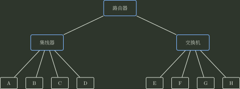
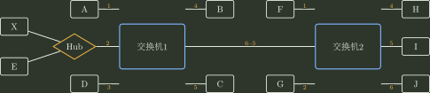

# 04｜PPP、局域网、交换机与 VLAN｜选择题

> 来源题号：791–826

[查看答案与逐题解析](04_PPP_局域网_交换机与VLAN_答案与解析.md)

## PPP 与二层交换基础

### 791

PPP 协议在异步线路中使用（①），在同步线路中使用（②）。

A. 字符填充，比特填充  
B. 比特填充，比特填充  
C. 比特填充，字符填充  
D. 字符填充，字符填充  

### 792

下列关于 PPP 中 LCP 协议和 NCP 协议的说法，正确的是（ ）。

A. LCP 协议在建立状态阶段协商数据链路协议的选项  
B. LCP 协议负责配置网络层协议并进行安全控制，保护通信双方的数据安全  
C. NCP 协议负责处理网络层协议的配置和多路复用，并检查数据链路层错误、通知错误信息  
D. NCP 协议提供链路层连接的建立和维护，实现数据链路层的错误检测和纠正  

### 793

以下关于高速以太网中二层交换机的论述，正确的是（ ）。

A. 二层交换机用于连接属于不同 IP 网段的以太网  
B. 二层交换机相当于一个多端口网桥  
C. 二层交换机不支持以太网的广播操作  
D. 二层交换机不能支持虚拟局域网的设置  

### 794

以太网交换机按照自学习算法建立转发表，它通过（ ）进行地址学习。

A. ARP 协议  
B. 帧中的源 MAC 地址和目的 MAC 地址  
C. 帧中的目的 MAC 地址  
D. 帧中的源 MAC 地址  

### 795

在下图所示网络中采用缺省配置。左侧集线器连接主机 A、B、C、D 和路由器的一个接口；右侧交换机连接主机 E、F、G、H 和路由器的另一个接口。该网络的广播域和冲突（碰撞）域个数分别是（ ）。

A. 2，2  
B. 2，6  
C. 6，6  
D. 8，8  

### 796

一台交换机具有 24 个 10/100 Mb/s 端口和 2 个 1 Gb/s 端口，如果所有端口都工作在全双工状态，那么交换机的最大带宽为（ ）。

A. 4.4 Gb/s  
B. 6.4 Gb/s  
C. 6.8 Gb/s  
D. 8.8 Gb/s  

## 令牌环、CDMA 与以太网

### 797

下列关于令牌环网络的描述中，错误的是（ ）。

A. 令牌环网络存在冲突的可能  
B. 同一时刻，环上只有一个结点的数据在传输  
C. 网上所有结点共享网络带宽  
D. 数据从一个结点到另一结点的时间可以计算  

### 798

下列关于令牌环网络的说法中，不正确的是（ ）。

I. 信道的利用率比较公平  
II. 重负载下信道利用率高  
III. 结点可以一直持有令牌，直至所要发送的数据传输完毕  
IV. 结点只能持有令牌一段固定的时间，对于没有数据要发送的结点也是如此

A. I、II 和 III  
B. III  
C. III 和 IV  
D. IV  

### 799

在令牌环网络中，当网络空闲时，环路中（ ）。

A. 只有令牌帧在循环传递  
B. 只有数据帧在循环传递  
C. 令牌帧和数据帧都在循环传递  
D. 令牌帧和数据帧都不在循环传递  

### 800

在令牌环网络中，当所有站点都有数据帧要发送时，一个站点在最坏情况下等待获得令牌并完成自身数据帧发送的时间等于（ ）。

A. 所有站点传送令牌的时间总和  
B. 所有站点传送令牌和发送帧的时间总和  
C. 所有站点传送令牌的时间总和的一半  
D. 所有站点传送令牌和发送帧的时间总和的一半  

### 801

在令牌环网络中，当一个站点收到自己发出的数据帧后，它将（ ）。

A. 不再转发该帧，并重新产生一个令牌  
B. 不再转发该帧，并等待下一个令牌  
C. 继续转发该帧，并重新产生一个令牌  
D. 继续转发该帧，并等待下一个令牌  

### 802

在一条广播信道上连有 4 个站点 a、b、c、d，采用码分复用技术。当 a、b、c 要向 d 发送数据时，设 a 的码片序列为 $(1,-1,1,-1)$，则 b 和 c 的码片序列可以为（ ）。

A. $(-1,1,1,1)$ 和 $(-1,-1,-1,1)$  
B. $(-1,-1,1,1)$ 和 $(-1,1,-1,1)$  
C. $(-1,1,1,-1)$ 和 $(1,1,-1,-1)$  
D. $(-1,-1,-1,-1)$ 和 $(1,1,1,1)$  

### 803

下列以太网中，采用双绞线作为传输介质的是（ ）。

A. 10BASE-2  
B. 10BASE-5  
C. 10BASE-T  
D. 10BASE-F  

### 804

同一局域网中的两个设备具有相同的静态 MAC 地址时，会发生（ ）。

A. 首次引导的设备排他地使用该地址，第二个设备不能通信  
B. 最后引导的设备排他地使用该地址，另一个设备不能通信  
C. 网络上的这两个设备都不能正确通信  
D. 两个设备都可以正常通信，因为它们可以读取帧的全部内容自行区分  

### 805

有一个长度为 56 字节的 IP 数据报需要通过以太网传输，则以太网 MAC 帧的数据载荷部分需要填充的字节数是（ ）。

A. 0  
B. 4  
C. 8  
D. 12  

### 806

在以太网中，若网卡发现某个帧的目的 MAC 地址不是自己的，则（ ）。

A. 将该帧递交给网络层，由网络层决定如何处理  
B. 丢弃该帧，并向网络层报告错误消息  
C. 丢弃该帧，不向网络层报告错误消息  
D. 向发送主机发回一个 NAK 帧  

### 807

在使用 CSMA/CD 的以太网中，站点（①）进行全双工通信，（②）进行半双工通信。

A. 可以，不可以  
B. 可以，可以  
C. 不可以，可以  
D. 不可以，不可以  

### 808

在 IEEE 802 局域网体系结构中，实现“给帧加序号”这类逻辑链路控制功能的子层是（ ）。

A. 物理层  
B. 逻辑链路控制子层（LLC）  
C. 介质访问控制子层（MAC）  
D. 网络层  

### 809

在传统共享式以太网中，有 A、B、C、D 四台主机。若 A 向 B 发送数据，则除 A 外（ ）。

A. 只有 B 可以在物理上接收到数据  
B. B、C 和 D 都能在物理上接收到数据  
C. 只有 B 不能接收到数据  
D. B、C 和 D 都不能接收到数据  

### 810

下列关于虚拟局域网（VLAN）的说法中，不正确的是（ ）。

A. 虚拟局域网建立在交换技术的基础上  
B. 虚拟局域网仅通过硬件方式实现逻辑分组与管理  
C. 虚拟网的划分与计算机的实际物理位置无关  
D. 虚拟局域网中的计算机可以处于不同的物理网段中  

### 811

在 802.11 协议中，MAC 帧首部中的地址字段最多有（ ）个。

A. 2  
B. 3  
C. 4  
D. 5  

### 812

在 802.11 协议中，MAC 帧首部中地址字段的含义和作用取决于（ ）。

A. 帧的类型和子类型  
B. 帧的源和目的站点  
C. To DS 和 From DS 位  
D. BSSID 和 SSID 位  

## LAN / WAN 与 PPP

### 813

按经典教材模型，局域网和广域网除覆盖范围外，在典型链路组织与采用的数据链路/接入协议体系上也通常不同。以下哪项最接近这一差异（ ）。

A. 所使用的介质不同  
B. 所使用的协议不同  
C. 所能支持的通信量不同  
D. 所提供的服务不同  

### 814

广域网所使用的典型传输方式是（ ）。

A. 广播式  
B. 存储转发式  
C. 集中控制式  
D. 分布控制式  

### 815

广域网的拓扑结构通常采用（ ）。

A. 星型  
B. 总线型  
C. 网状  
D. 环形  

### 816

为实现透明传输（默认为异步线路），PPP 使用的填充方法是（ ）。

A. 位填充  
B. 字符填充  
C. 对字符数据使用字符填充，对非字符数据使用位填充  
D. 对字符数据使用位填充，对非字符数据使用字符填充  

### 817

以下关于 PPP 的说法中，错误的是（ ）。

A. 具有差错检测能力  
B. 仅支持 IP 协议  
C. 支持网络层地址协商，可用于动态配置 IP 地址  
D. 支持身份验证机制  

### 818

从 PPP **向网络层提供的数据交付服务语义**看，PPP 提供的是（ ）。

A. 无连接的不可靠服务  
B. 无连接的可靠服务  
C. 有连接的不可靠服务  
D. 有连接的可靠服务  

### 819

下列关于数据链路层设备的叙述中，错误的是（ ）。

A. 交换机将网络划分成多个网段，一个网段的故障通常不会直接影响另一个交换端口上的网段运行  
B. 交换机可互连使用不同物理层实现、不同速率的以太网链路  
C. 交换机的各接口可以形成独立链路带宽，整个交换结构的可并行吞吐能力可随端口增加而提高  
D. 利用交换机可以实现 VLAN，VLAN 可以隔离冲突域，但不能隔离广播域  

### 820

一个 16 接口的集线器，其冲突域和广播域的个数分别是（ ）。

A. 16，1  
B. 16，16  
C. 1，1  
D. 1，16  

### 821

一个 16 接口的以太网交换机，在未配置 VLAN 的默认情况下，其冲突域和广播域的个数分别是（ ）。

A. 1，1  
B. 16，16  
C. 1，16  
D. 16，1  

### 822

对于由交换机连接的 10 Mb/s 以太网，若共有 10 个用户，则每个用户能够占有的端口链路带宽为（ ）。

A. 1 Mb/s  
B. 2 Mb/s  
C. 10 Mb/s  
D. 100 Mb/s  

### 823

若一个网络采用具有 24 个 10 Mb/s 接口的半双工交换机作为连接设备，则：

1. 每个连接点可获得的带宽为（①）；
2. 该交换机在题目所采用的“可同时支持 12 对端口通信”的容量口径下，总容量为（②）。

①  
A. 0.417 Mb/s  
B. 0.0417 Mb/s  
C. 4.17 Mb/s  
D. 10 Mb/s  

②  
A. 120 Mb/s  
B. 240 Mb/s  
C. 10 Mb/s  
D. 24 Mb/s  

### 824

假设以太网 A 中 80% 的通信量在本局域网内进行，其余 20% 在本局域网与因特网之间进行，而以太网 B 正好相反。在这两个局域网中，一个使用集线器，另一个使用交换机，则交换机应放置在（ ）。

A. 以太网 A  
B. 以太网 B  
C. 任意以太网  
D. 都不合适  

### 825

以太网交换机的自学习功能是指（ ）。

A. 记录帧的源 MAC 地址与该帧进入交换机的接口号  
B. 记录帧的目的 MAC 地址与该帧进入交换机的接口号  
C. 记录分组的源 IP 地址与该分组进入交换机的接口号  
D. 记录分组的目的 IP 地址与该分组进入交换机的接口号  

### 826

某以太网如下图所示。交换机 1 和交换机 2 的交换表初始为空，各主机依次进行通信：`A→B`、`H→A`、`E→X`、`X→E`。关于上述通信过程的叙述，错误的是（ ）。

A. 当 `A→B` 时，除 A 外的全部主机都能在物理上收到 A 发送的帧  
B. 当 `H→A` 时，仅 A 能收到 H 发送的帧  
C. 当 `E→X` 时，仅 X 能收到 E 发送的帧  
D. 当 `X→E` 时，交换机 2 收不到 X 发送的帧  
