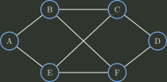
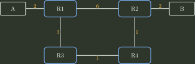

# 06｜路由协议与控制平面｜选择题

> 来源题号：874–890

[查看答案与逐题解析](06_路由协议与控制平面_答案与解析.md)

## 静态/动态路由与分层路由

### 874

动态路由选择和静态路由选择的主要区别是（ ）。

A. 动态路由选择必须维护整个网络的完整拓扑，而静态路由选择只维护部分拓扑  
B. 动态路由选择可根据网络拓扑或度量变化自动调整，静态路由则主要依赖人工配置或外部管理机制调整  
C. 动态路由选择一定更简单、开销更小，静态路由一定更复杂、开销更大  
D. 只有动态路由选择使用路由表，静态路由选择不使用路由表  

### 875

下列关于分层路由的描述中，错误的是（ ）。

A. 分层路由把大型网络划分为区域/自治域，使详细拓扑状态主要限制在较小作用域内  
B. 为了保证可达性，每台路由器都必须掌握其他所有区域的完整内部拓扑细节  
C. 不同自治系统可采用不同的内部路由协议，并通过跨域路由机制交换对外可达性  
D. 网络规模很大时，可以继续采用多级层次结构压缩路由状态  

## RIP、OSPF 与 BGP

### 876

运行 OSPF 的路由器每 10 s 在某接口发送 Hello 分组。若本题采用经典默认 Dead Interval 为 Hello Interval 的 4 倍，则在（ ）秒内未再收到某邻居 Hello 后，可认为该邻居失效。

A. 30  
B. 40  
C. 50  
D. 60  

### 877

以下关于 OSPF 自治系统与区域的描述中，不正确的是（ ）。

A. 划分区域可把链路状态洪泛的详细范围限制在区域内，而不是让所有区域共享完全相同的详细 LSDB  
B. 分层划分区域会引入更多区域/摘要相关状态，因此必然使 OSPF 协议机制本身更简单  
C. OSPF 可以把一个自治系统划分为若干较小的区域  
D. 区域内部路由器掌握本区域的详细拓扑，而对其他区域通常只掌握经过区域边界传播的可达性/摘要信息  

### 878

在 RIP 协议中，路由器 X 与路由器 K 相邻。X 向 K 通告：“我到目的网络 Y 的距离为 $N$”。若 K 选择 X 作为到 Y 的下一跳，且本题每条相邻链路代价按 1 跳计算，则 K 到 Y 的距离为（ ）。（$N<15$）

A. $N$  
B. $N-1$  
C. 1  
D. $N+1$  

### 879

RIP 路由器收到相邻路由器发来的路由更新后，发现某目的存在更优候选路由，则（ ）。

A. 按 RIP 更新规则重新选择并更新本地路由状态  
B. 必须向部分邻居发送确认后才能更新  
C. 必须向所有邻居发送确认后才能更新  
D. 不更新自己的路由状态  

### 880

下列关于 RIP 和 OSPF 的叙述中，错误的是（ ）。

A. RIP 和 OSPF 都属于自治系统内部使用的路由协议（IGP）  
B. RIP 路由更新只发给相邻 RIP 路由器；OSPF 的链路状态信息在相应 Area 内可靠洪泛  
C. RIP 典型地周期性交换距离向量/路由表信息，而 OSPF 只是把“路由表的一部分”发送给其他路由器  
D. RIP 路由器不保存完整网络拓扑；OSPF 路由器可依据本区域 LSDB 建立本区域拓扑视图  

### 881

使用距离向量路由协议时可能出现路由回路。造成这一问题的根本原因是（ ）。

A. 路由器从不报告自己的直连链路信息  
B. 路由器收到更新后总会原样立即发回给发送者  
C. 只要有一个路由更新分组被丢弃就一定形成永久回路  
D. 异步传播与慢收敛会使不同路由器在一段时间内继续持有并相互引用已经失效的路由信息  

### 882

下列有关 Internet 路由协议的描述，正确的是（ ）。

A. RIP 是距离向量 IGP，而 OSPF 是用于自治系统之间的外部网关协议  
B. RIP 使用跳数作为度量，并使用 Dijkstra 最短路径优先算法计算路由  
C. 在同一 OSPF Area 内，路由器依据同步的链路状态数据库建立拓扑视图并运行 SPF；RIP 路由器则不需要保存这样的完整拓扑图  
D. OSPF 的典型特点是“好消息传得快，坏消息传得慢”  

### 883

OSPF 协议使用（ ）分组发现并保持邻居关系。

A. Hello  
B. Keepalive  
C. SPF（最短路径优先）  
D. LSU（链路状态更新）  

### 884

以下关于 OSPF 协议的描述中，最准确的是（ ）。

A. OSPF 根据链路状态数据库运行最短路径优先算法计算域内路由  
B. OSPF 是用于自治系统之间的外部网关协议  
C. OSPF 不能根据网络拓扑变化动态改变路由  
D. OSPF 只适用于小型网络  

### 885

以下关于 OSPF 协议特征的描述中，错误的是（ ）。

A. OSPF 可将一个自治系统划分为多个区域，其中 Area 0 为主干区域  
B. 区域之间通过区域边界路由器等机制互联  
C. 教材中常把 OSPF 路由器按区域内部、主干、区域边界和自治系统边界等角色分类  
D. 主干路由器不能同时兼作区域边界路由器  

### 886

下列关于 OSPF 和 BGP 的描述中，正确的是（ ）。

A. OSPF 路由器只保存目的前缀与下一跳，不需要维护本区域的链路状态拓扑信息  
B. BGP 用于自治系统之间交换可达性及路径属性，并在本地策略约束下选择跨域路由  
C. OSPF 不能根据链路状态变化动态重新计算路由，因此只适合静态小型网络  
D. BGP 是自治系统内部的最短路径协议，要求所有 AS 使用统一链路度量  

### 887

RIP、OSPF、BGP 的路由选择知识表示分别属于（ ）。

A. 路径向量、链路状态、距离向量  
B. 距离向量、路径向量、链路状态  
C. 路径向量、距离向量、链路状态  
D. 距离向量、链路状态、路径向量  

### 888

从数据封装角度看，下列协议中属于 TCP/IP 参考模型应用层的是（ ）。

I. OSPF  
II. RIP  
III. BGP  
IV. ICMP

A. I、II  
B. II、III  
C. I、IV  
D. I、II、III、IV  

### 889

如下图所示子网使用距离向量算法。向量刚刚到达路由器 C：来自 B 的向量为 $(5,0,8,12,6,2)$；来自 D 的向量为 $(16,12,6,0,9,10)$；来自 E 的向量为 $(7,6,3,9,0,4)$。C 到 B、D、E 的直接代价分别为 6、3、5。若向量中的结点顺序为 A、B、C、D、E、F，则 C 更新后到所有结点的最短距离向量为（ ）。

A. $(5,6,0,9,6,2)$  
B. $(11,6,0,3,5,8)$  
C. $(5,11,0,12,8,9)$  
D. $(11,8,0,7,4,9)$  

### 890

某分组交换网络拓扑如下，各路由器运行 OSPF 且均已收敛，图中数字为链路度量。各段链路带宽均为 100 Mb/s。每个分组总长度为 1000 B，其中首部 20 B。主机 A 向主机 B 发送一个 980000 B 文件，采用存储转发，忽略传播时延和封装/解封装时间。则从 A 开始发送到 B 接收完毕的时间为（ ）。

A. 80.08 ms  
B. 80.16 ms  
C. 80.32 ms  
D. 80.64 ms  
