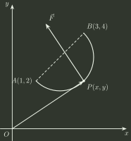

# q19_高等数学

## 📋 题目要求 (题面)

质点 $P$ 沿着以 $AB$ 为直径的圆周，从点 $A(1,2)$ 运动到点 $B(3,4)$ 的过程中受变力 $\hat{F}$ 作用(见图)， $\hat{F}$ 的大小等于点 $P$ 与原点 $O$ 之间的距离，其方向垂直于线段 $OP$ 且与 $y$ 轴正向的夹角小于 $\frac{\pi}{2}$ ． 求变力 $\hat{F}$ 对质点 $P$ 所作的功．

---

## 💡 答案与深度解析

**【答案】** $2(\pi -1)$

**【解析】** 质点受变力 $\hat{F}$ 作用，力的大小等于点 $P$ 与原点 $O$ 之间的距离，即 $|\hat{F}|=\sqrt{x^{2}+y^{2}}$，方向垂直于线段 $OP$ 且与 $y$ 轴正向的夹角小于 $\frac{\pi}{2}$。由此可得 $\hat{F}=(-y,x)$。

变力对质点所作的功为线积分 $W=\int _{C}\hat{F}\cdot d\hat{r}=\int _{C}(-ydx+xdy)$，其中路径 $C$ 是以 $AB$ 为直径的圆弧，从点 $A(1,2)$ 到点 $B(3,4)$。

圆的圆心为 $AB$ 的中点 $C(2,3)$，半径 $r=\sqrt{2}$。参数化路径： $x=2+\sqrt{2}\cos \theta$， $y=3+\sqrt{2}\sin \theta$， 其中 $\theta$ 从 $-\frac{3\pi}{4}$ 到 $\frac{\pi}{4}$。

计算微分： $dx=-\sqrt{2}\sin \theta d\theta$， $dy=\sqrt{2}\cos \theta d\theta$。

代入积分：

$$
W=\int _{-\frac{3\pi}{4}}^{\frac{\pi}{4}}[-ydx+xdy]=\int _{-\frac{3\pi}{4}}^{\frac{\pi}{4}}[-(3+\sqrt{2}\sin \theta )(-\sqrt{2}\sin \theta d\theta )+(2+\sqrt{2}\cos \theta )(\sqrt{2}\cos \theta d\theta )]
$$

简化被积函数：

$$
\sqrt{2}[(3+\sqrt{2}\sin \theta )\sin \theta +(2+\sqrt{2}\cos \theta )\cos \theta ]d\theta =\sqrt{2}[3\sin \theta +\sqrt{2}\sin ^{2}\theta +2\cos \theta +\sqrt{2}\cos ^{2}\theta ]d\theta
$$

$$
=\sqrt{2}[3\sin \theta +2\cos \theta +\sqrt{2}(\sin ^{2}\theta +\cos ^{2}\theta )]d\theta =\sqrt{2}[3\sin \theta +2\cos \theta +\sqrt{2}]d\theta
$$

因此，

$$
W=\sqrt{2}\int _{-\frac{3\pi}{4}}^{\frac{\pi}{4}}[3\sin \theta +2\cos \theta +\sqrt{2}]d\theta
$$

计算积分：

$$
\int 3\sin \theta d\theta =-3\cos \theta ,\int 2\cos \theta d\theta =2\sin \theta ,\int \sqrt{2}d\theta =\sqrt{2}\theta
$$

代入上下限：

$$
[-3\cos \theta ]_{-\frac{3\pi}{4}}^{\frac{\pi}{4}}=-3[\cos (\frac{\pi}{4})-\cos (-\frac{3\pi}{4})]=-3[\frac{\sqrt{2}}{2}-(-\frac{\sqrt{2}}{2})]=-3\sqrt{2}
$$

$$
[2\sin \theta ]_{-\frac{3\pi}{4}}^{\frac{\pi}{4}}=2[\sin (\frac{\pi}{4})-\sin (-\frac{3\pi}{4})]=2[\frac{\sqrt{2}}{2}-(-\frac{\sqrt{2}}{2})]=2\sqrt{2}
$$

$$
[\sqrt{2}\theta ]_{-\frac{3\pi}{4}}^{\frac{\pi}{4}}=\sqrt{2}[\frac{\pi}{4}-(-\frac{3\pi}{4})]=\sqrt{2}\pi
$$

积分结果为：

$$
-3\sqrt{2}+2\sqrt{2}+\sqrt{2}\pi =\sqrt{2}(\pi -1)
$$

于是，

$$
W=\sqrt{2}\cdot \sqrt{2}(\pi -1)=2(\pi -1)
$$

故变力 $\hat{F}$ 对质点 $P$ 所作的功为 $2(\pi -1)$。

填空题
