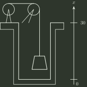

# 1999 年全国硕士研究生招生考试 数学（一）真题

## 一、填空题（第 1～5 小题，每小题 3 分，共 15 分）

### 1

$\displaystyle \lim_{x\to0}\left(\frac1{x^2}-\frac1{x\tan x}\right)=$ ______．

### 2

$\frac{d}{dx}\int _{0}^{x}\sin ((x-t)^{2})dt=$ ______．

### 3

微分方程 $y''-4y=e^{2x}$ 的通解为 $y=$ ______．

### 4

设 $n$ 阶矩阵 $A$ 的元素全为 $1$，则 $A$ 的 $n$ 个特征值是 ______．

### 5

设两两相互独立的三事件 $A$ , $B$ 和 $C$ 满足条件：

$$
A\cap B\cap C=\varnothing,\qquad P(A)=P(B)=P(C)<\frac12,\qquad P(A\cup B\cup C)=\frac9{16},
$$

则 $P(A)=$ ______．

## 二、单项选择题（第 6～10 小题，每小题 3 分，共 15 分）

### 6

设 $f(x)$ 是连续函数， $F(x)$ 是 $f(x)$ 的原函数，则

- **A.** 当 $f(x)$ 是奇函数时， $F(x)$ 必是偶函数．
- **B.** 当 $f(x)$ 是偶函数时， $F(x)$ 必是奇函数．
- **C.** 当 $f(x)$ 是周期函数时， $F(x)$ 必是周期函数．
- **D.** 当 $f(x)$ 是单调增函数时， $F(x)$ 必是单调增函数．

### 7

设 $f(x)=\begin{cases} \dfrac{1-\cos x}{\sqrt{x}}, & x>0, \\ x^{2}g(x), & x\le 0, \end{cases}$ 其中 $g(x)$ 是有界函数，则 $f(x)$ 在 $x=0$ 处

- **A.** 极限不存在．
- **B.** 极限存在，但不连续．
- **C.** 连续，但不可导．
- **D.** 可导．

### 8

设 $f(x)=\begin{cases} x, & 0\le x\le \frac{1}{2} \\ 2-2x, & \frac{1}{2}<x<1 \end{cases}$， $S(x)=\frac{a_{0}}{2}+\sum _{n=1}^{\infty}a_{n}\cos n\pi x$ , $-\infty <x<+\infty$，其中 $a_{n}=2\int _{0}^{1}f(x)\cos n\pi xdx$ （$n=0,1,2,\cdots$）， 则 $S(-\frac{5}{2})$ 等于

- **A.** $\frac{1}{2}$ ．
- **B.** $-\frac{1}{2}$ ．
- **C.** $\frac{3}{4}$ ．
- **D.** $-\frac{3}{4}$ ．

### 9

设 $A$ 是 $m\times n$ 矩阵， $B$ 是 $n\times m$ 矩阵，则

- **A.** 当 $m>n$ 时，必有行列式 $|AB|\ne 0$ ．
- **B.** 当 $m>n$ 时，必有行列式 $|AB|=0$ ．
- **C.** 当 $n>m$ 时，必有行列式 $|AB|\ne 0$ ．
- **D.** 当 $n>m$ 时，必有行列式 $|AB|=0$ ．

### 10

设两个相互独立的随机变量 $X$ 和 $Y$ 分别服从正态分布 $N(0,1)$ 和 $N(1,1)$，则

- **A.** $P\{X+Y\le 0\}=\frac{1}{2}$ ．
- **B.** $P\{X+Y\le 1\}=\frac{1}{2}$ ．
- **C.** $P\{X-Y\le 0\}=\frac{1}{2}$ ．
- **D.** $P\{X-Y\le 1\}=\frac{1}{2}$ ．

## 三、解答题（第 11～21 小题，共 70 分）

### 11（本题满分 5 分）

设 $y=y(x)$， $z=z(x)$ 是由方程 $z=xf(x+y)$ 和 $F(x,y,z)=0$ 所确定的函数， 其中 $f$ 和 $F$ 分别具有一阶连续导数和一阶连续偏导数，求 $\frac{dz}{dx}$ ．

### 12（本题满分 5 分）

求 $I=\int _{L}(e^{x}\sin y-b(x+y))dx+(e^{x}\cos y-ax)dy$， 其中 $a$ , $b$ 为正常数， $L$ 为从点 $A(2a,0)$ 沿曲线 $y=\sqrt{2ax-x^{2}}$ 到点 $O(0,0)$ 的弧．

### 13（本题满分 6 分）

设函数 $y(x)$ （$x\ge 0$）二阶可导，且 $y'(x)>0$， $y(0)=1$ ． 过曲线 $y=y(x)$ 上任意一点 $P(x,y)$ 作该曲线的切线及 $x$ 轴的垂线， 上述两直线与 $x$ 轴所围成的三角形的面积记为 $S_{1}$，区间 $[0,x]$ 上以 $y=y(x)$ 为曲边的曲边梯形面积记为 $S_{2}$， 并设 $2S_{1}-S_{2}$ 恒为 $1$，求此曲线 $y=y(x)$ 的方程．

### 14（本题满分 6 分）

试证：当 $x>0$ 时， $(x^{2}-1)\ln x\ge (x-1)^{2}$ ．

### 15（本题满分 6 分）

为清除井底的污泥，用缆绳将抓斗放入井底，抓起污泥后提出井口（见图），已知井深 30m，抓斗自重 400N，缆绳每米重 50N，抓斗抓起的污泥重 2000N，提升速度为 $3m/s$，在提升过程中，污泥以 20N/s 的速度从抓斗缝隙中漏掉，现将抓起污泥的抓斗提升至井口，问克服重力需作多少焦耳的功？

(说明：① $1N\times 1m=1J$；其中 $m,N,s,J$ 分别表示米、牛顿、秒、焦耳； ② 抓斗的高度及位于井口上方的缆绳长度忽略不计。)

### 16（本题满分 7 分）

设 $S$ 为椭球面 $\frac{x^{2}}{2}+\frac{y^{2}}{2}+z^{2}=1$ 的上半部分， 点 $P(x,y,z)\in S$， $\pi$ 为 $S$ 在点 $P$ 处的切平面， $\rho (x,y,z)$ 为点 $O(0,0,0)$ 到平面 $\pi$ 的距离， 求 $\iint _{S}\frac{z}{\rho (x,y,z)}dS$ ．

### 17（本题满分 7 分）

设 $a_{n}=\int _{0}^{\frac{\pi}{4}}\tan ^{n}xdx$，

(1) 求 $\sum _{n=1}^{\infty}\frac{1}{n}(a_{n}+a_{n+2})$ 的值；

(2) 试证：对任意的常数 $\lambda >0$，级数 $\sum _{n=1}^{\infty}\frac{a_{n}}{n^{\lambda}}$ 收敛．

### 18（本题满分 8 分）

设矩阵 $A=\begin{pmatrix} a & -1 & c \\ 5 & b & 3 \\ 1-c & 0 & -a \end{pmatrix}$，其行列式 $|A|=-1$，又 $A$ 的伴随矩阵 $A^{∗}$ 有一个特征值 $\lambda _{0}$， 属于 $\lambda _{0}$ 的一个特征向量为 $\alpha =(-1,-1,1)^{T}$，求 $a,b,c$ 和 $\lambda _{0}$ 的值．

### 19（本题满分 6 分）

设 $A$ 为 $m$ 阶实对称矩阵且正定， $B$ 为 $m\times n$ 实矩阵， $B^{T}$ 为 $B$ 的转置矩阵， 试证： $B^{T}AB$ 为正定矩阵的充分必要条件是 $B$ 的秩 $r(B)=n$ ．

### 20（本题满分 8 分）

设随机变量 $X$ 与 $Y$ 相互独立，下表列出了二维随机变量 $(X,Y)$ 的联合分布律及 关于 $X$ 和关于 $Y$ 的边缘分布律中的部分数值，试将其余数值填入表中的空白处．

$$
\begin{array}{c|ccc|c}
X\backslash Y & y_1 & y_2 & y_3 & P(X=x_i)\\ \hline
x_1 & & \frac18 & & \\
x_2 & \frac18 & & & \\ \hline
P(Y=y_j) & \frac16 & & & 1
\end{array}
$$

### 21（本题满分 6 分）

设总体 $X$ 的概率密度为

$$
f(x;\theta)=\begin{cases} \dfrac{6x}{\theta^3}(\theta-x), & 0<x<\theta, \\ 0, & \text{其他}. \end{cases}
$$

$X_{1},X_{2},\cdots ,X_{n}$ 是取自总体 $X$ 的简单随机样本．

(1) 求 $\theta$ 的矩估计量 $\hat\theta$；

(2) 求 $\hat\theta$ 的方差 $D(\hat\theta)$ ．

