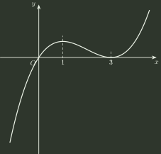
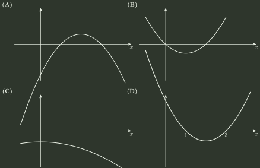

# 2001 年全国硕士研究生招生考试 数学（一）真题

## 一、填空题（第 1～5 小题，每小题 3 分，共 15 分）

### 1

设 $y=e^{x}(c_{1}\sin x+c_{2}\cos x)$ （$c_{1},c_{2}$ 为任意常数）为某二阶常系数线性齐次微分方程的通解，则该方程为 ______．

### 2

设 $r=\sqrt{x^{2}+y^{2}+z^{2}}$，则 $\left.\operatorname{div}(\nabla r)\right|_{(1,-2,2)}=$ ______。

### 3

交换二次积分的积分次序：$\int _{-1}^{0}\mathrm{d}y\int _{2}^{1-y}f(x,y)\,\mathrm{d}x=$ ______。

### 4

设矩阵 $A$ 满足 $A^{2}$ $+A-4E=0$，其中 $E$ 为单位矩阵，则 $(A-E)^{-1}$ = ______．

### 5

设随机变量 $X$ 的方差为 $2$，则根据切比雪夫不等式有估计 $P\{\lvert X-E(X)\rvert\ge 2\}\le$ ______．

## 二、单项选择题（第 6～10 小题，每小题 3 分，共 15 分）

### 6

设函数 $f(x)$ 在定义域内可导，$y=f(x)$ 的图形如下图所示，则导函数 $y=f'(x)$ 的图形为

- **A.** 见选项图示 (A)
- **B.** 见选项图示 (B)
- **C.** 见选项图示 (C)
- **D.** 见选项图示 (D)

### 7

设函数 $f(x,y)$ 在点 $(0,0)$ 附近有定义，且 $f_{x}^{'}(0,0)=3,f_{y}^{'}(0,0)=1$，则

- **A.** $\left.\mathrm{d}z\right|_{(0,0)}=3\,\mathrm{d}x+\mathrm{d}y$。
- **B.** 曲面 $z=f(x,y)$ 在点 $(0,0,f(0,0))$ 的法向量为 $(3,1,1)$ ．
- **C.** 曲线 $\begin{cases} z=f(x,y) \\ y=0 \end{cases}$ 在点 $(0,0,f(0,0))$ 的切向量为 $(1,0,3)$ ．
- **D.** 曲线 $\begin{cases} z=f(x,y) \\ y=0 \end{cases}$ 在点 $(0,0,f(0,0))$ 的切向量为 $(3,0,1)$ ．

### 8

设 $f(0)=0$，则 $f(x)$ 在点 $x=0$ 可导的充要条件为

- **A.** $\displaystyle\lim_{h\to0}\frac{f(1-\cos h)}{h^2}$ 存在．
- **B.** $\displaystyle\lim_{h\to0}\frac{f(1-\mathrm{e}^h)}{h}$ 存在。
- **C.** $\displaystyle\lim_{h\to0}\frac{f(h-\sin h)}{h^2}$ 存在．
- **D.** $\displaystyle\lim_{h\to0}\frac{f(2h)-f(h)}{h}$ 存在．

### 9

设 $A=\begin{pmatrix} 1 & 1 & 1 & 1 \\ 1 & 1 & 1 & 1 \\ 1 & 1 & 1 & 1 \\ 1 & 1 & 1 & 1 \end{pmatrix},B=\begin{pmatrix} 4 & 0 & 0 & 0 \\ 0 & 0 & 0 & 0 \\ 0 & 0 & 0 & 0 \\ 0 & 0 & 0 & 0 \end{pmatrix}$，则 $A$ 与 $B$

- **A.** 合同且相似．
- **B.** 合同但不相似．
- **C.** 不合同但相似．
- **D.** 不合同且不相似．

### 10

将一枚硬币重复掷 $n$ 次，以 $X$ 和 $Y$ 分别表示正面向上和反面向上的次数，则 $X$ 和 $Y$ 的相关系数等于

- **A.** $-1$ ．
- **B.** $0$ ．
- **C.** $\frac{1}{2}$ ．
- **D.** $1$ ．

## 三、解答题（第 11～20 小题，共 70 分）

### 11（本题满分 6 分）

$$
\int \frac{\arctan \mathrm{e}^{x}}{\mathrm{e}^{2x}}\,\mathrm{d}x=
$$

### 12（本题满分 6 分）

设函数 $z=f(x,y)$ 在点(1,1) 处可微，且

$$
f(1,1)=1,\quad\left.\frac{\partial f}{\partial x}\right|_{(1,1)}=2,\quad\left.\frac{\partial f}{\partial y}\right|_{(1,1)}=3,\quad\varphi (x)=f(x,f(x,x)).
$$

求 $\left.\frac{\mathrm{d}}{\mathrm{d}x}\varphi ^{3}(x)\right|_{x=1}$。

### 13（本题满分 8 分）

设 $f(x)=\begin{cases} \frac{1+x^{2}}{x}\arctan x, & x\ne 0; \\ 1, & x=0. \end{cases}$ 试将 $f(x)$ 展开成 $x$ 的幂级数，并求级数 $\sum _{n=1}^{\infty}\frac{(-1)^{n}}{1-4n^{2}}$ 的和．

### 14（本题满分 7 分）

计算 $I=\oint _{L}(y^{2}-z^{2})\,\mathrm{d}x+(2z^{2}-x^{2})\,\mathrm{d}y+(3x^{2}-y^{2})\,\mathrm{d}z$，其中 $L$ 是平面 $x+y+z=2$ 与柱面 $\lvert x\rvert+\lvert y\rvert=1$ 的交线，从 $z$ 轴正向看去， $L$ 为逆时针方向．

### 15（本题满分 7 分）

设 $y=f(x)$ 在 $(-1,1)$ 内具有二阶连续导数且 $f''(x)\ne 0$，试证：

(1) 对于 $(-1,1)$ 内的任意 $x\ne 0$，存在唯一的 $\theta (x)\in (0,1)$， 使得 $f(x)=f(0)+xf'(\theta (x)x)$ 成立；

(2) $\lim _{x\to 0}\theta (x)=\frac{1}{2}$ ．

### 16（本题满分 8 分）

设有一高度为 $h(t)$ （$t$ 为时间）的雪堆在融化过程中，其侧面满足方程

$$
z=h(t)-\frac{2(x^{2}+y^{2})}{h(t)}
$$

（设长度单位为厘米，时间单位为小时），已知体积减少的速率与侧面积成正比（比例系数 $0.9$）， 问高度为 $130$ 厘米的雪堆全部融化需多少小时？

### 17（本题满分 6 分）

设 $\alpha _{1},\alpha _{2},\cdots ,\alpha _{s}$ 为线性方程组 $Ax=0$ 的一个基础解系，

$$
\beta _{1}=t_{1}\alpha _{1}+t_{2}\alpha _{2},\beta _{2}=t_{1}\alpha _{2}+t_{2}\alpha _{3},\cdots ,\beta _{s}=t_{1}\alpha _{s}+t_{2}\alpha _{1},
$$

其中 $t_{1},t_{2}$ 为实常数．试问 $t_{1},t_{2}$ 满足什么关系时， $\beta _{1},\beta _{2},\cdots ,\beta _{s}$ 也为 $Ax=0$ 的一个基础解系？

### 18（本题满分 8 分）

已知 $3$ 阶矩阵 $A$ 与三维向量 $x$，使得向量组 $x,Ax,A^{2}x$ 线性无关，且满足

$$
A^{3}x=3Ax-2A^{2}x.
$$

(1) 记 $P=(x,Ax,A^{2}x)$，求 $3$ 阶矩阵 $B$，使 $A=PBP^{-1}$；

(2) 计算行列式 $\lvert A+E\rvert$。

### 19（本题满分 7 分）

设某班车起点站上客人数 $X$ 服从参数 $\lambda$ （$\lambda >0$）的泊松分布， 每位乘客在中途下车的概率为 $p$ （$0<p<1$），且途中下车与否相互独立，以 $Y$ 表示在中途下车的人数，求：

(1) 在发车时有 $n$ 个乘客的条件下，中途有 $m$ 人下车的概率；

(2) 二维随机变量 $(X,Y)$ 的概率分布．

### 20（本题满分 7 分）

设总体 $X$ 服从正态分布 $N(\mu ,\sigma ^{2})$ （$\sigma >0$）， 从该总体中抽取简单随机样本 $X_{1}$ , $X_{2}$ , $\cdots$ , $X_{2n}$ （$n\ge 2$）， 其样本均值为 $\bar X=\frac{1}{2n}\sum_{i=1}^{2n}X_i$，求统计量

$$
Y=\sum_{i=1}^{n}(X_i+X_{n+i}-2\bar X)^2
$$

的数学期望 $E(Y)$ ．

