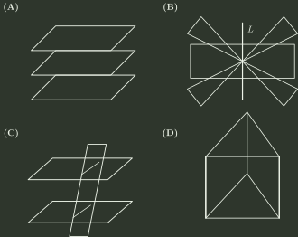

# 2002 年全国硕士研究生招生考试 数学（一）真题

## 一、填空题（第 1～5 小题，每小题 3 分，共 15 分）

### 1

$$
\int _{\mathrm{e}}^{+\infty}\frac{\mathrm{d}x}{x\ln ^{2}x}=
$$

### 2

已知函数 $y=y(x)$ 由方程 $\mathrm{e}^{y}+6xy+x^{2}-1=0$ 确定，则 $y''(0)=$ ______．

### 3

微分方程 $yy''+(y')^{2}=0$ 满足初始条件 $\left.y\right|_{x=0}=1$，$\left.y'\right|_{x=0}=\frac{1}{2}$ 的特解是 ______．

### 4

已知实二次型 $f(x_{1},x_{2},x_{3})=a(x_{1}^{2}+x_{2}^{2}+x_{3}^{2})+4x_{1}x_{2}+4x_{1}x_{3}+4x_{2}x_{3}$ 经正交变换 $x=Py$ 可化成标准型 $f=6y_{1}^{2}$，则 $a=$ ______．

### 5

设随机变量 $X$ 服从正态分布 $N(\mu ,\sigma ^{2})$ （$\sigma >0$）， 且二次方程 $y^{2}+4y+X=0$ 无实根的概率为 $\frac{1}{2}$，则 $\mu =$ ______．

## 二、单项选择题（第 6～10 小题，每小题 3 分，共 15 分）

### 6

考虑二元函数 $f(x,y)$ 的下面4条性质：

① $f(x,y)$ 在点 $(x_{0},y_{0})$ 处连续， ② $f(x,y)$ 在点 $(x_{0},y_{0})$ 处的两个偏导数连续，

③ $f(x,y)$ 在点 $(x_{0},y_{0})$ 处可微， ④ $f(x,y)$ 在点 $(x_{0},y_{0})$ 处的两个偏导数存在．

若用“$P\Rightarrow Q$”表示可由性质 $P$ 推出 $Q$，则有

- **A.** ② $\Rightarrow$ ③ $\Rightarrow$ ①．
- **B.** ③ $\Rightarrow$ ② $\Rightarrow$ ①．
- **C.** ③ $\Rightarrow$ ④ $\Rightarrow$ ①．
- **D.** ③ $\Rightarrow$ ① $\Rightarrow$ ④．

### 7

设 $u_{n}\ne 0$ （$n=1,2,3,\cdots$），且 $\lim _{n\to \infty}\frac{n}{u_{n}}=1$， 则级数 $\sum _{n=1}^{\infty}(-1)^{n+1}(\frac{1}{u_{n}}+\frac{1}{u_{n+1}})$

- **A.** 发散．
- **B.** 绝对收敛．
- **C.** 条件收敛．
- **D.** 收敛性根据所给条件不能判定．

### 8

设函数 $y=f(x)$ 在 $(0,+\infty )$ 内有界且可导，则

- **A.** 当 $\lim _{x\to +\infty}f(x)=0$ 时，必有 $\lim _{x\to +\infty}f'(x)=0$ ．
- **B.** 当 $\lim _{x\to +\infty}f'(x)$ 存在时，必有 $\lim _{x\to +\infty}f'(x)=0$ ．
- **C.** 当 $\lim _{x\to 0^{+}}f(x)=0$ 时，必有 $\lim _{x\to 0^{+}}f'(x)=0$ ．
- **D.** 当 $\lim _{x\to 0^{+}}f'(x)$ 存在时，必有 $\lim _{x\to 0^{+}}f'(x)=0$ ．

### 9

设有三张不同平面的方程 $a_{i1}x+a_{i2}y+a_{i3}z=b_{i},i=1,2,3$， 它们所组成的线性方程组的系数矩阵与增广矩阵的秩都为 $2$，则这三张平面可能的位置关系为

- **A.** 见选项图示 (A)
- **B.** 见选项图示 (B)
- **C.** 见选项图示 (C)
- **D.** 见选项图示 (D)

### 10

设 $X_{1}$ 和 $X_{2}$ 是任意两个相互独立的连续型随机变量，它们的概率密度分别为 $f_{1}(x)$ 和 $f_{2}(x)$，分布函数分别为 $F_{1}(x)$ 和 $F_{2}(x)$，则

- **A.** $f_{1}(x)+f_{2}(x)$ 必为某一随机变量的概率密度．
- **B.** $f_{1}(x)f_{2}(x)$ 必为某一随机变量的概率密度．
- **C.** $F_{1}(x)+F_{2}(x)$ 必为某一随机变量的分布函数．
- **D.** $F_{1}(x)F_{2}(x)$ 必为某一随机变量的分布函数．

## 三、解答题（第 11～20 小题，共 70 分）

### 11（本题满分 6 分）

设函数 $f(x)$ 在 $x=0$ 的某邻域内具有一阶连续导数，且 $f(0)\ne 0,f'(0)\ne 0$， 若 $af(h)+bf(2h)-f(0)$ 在 $h\to 0$ 时是比 $h$ 高阶的无穷小，试确定 $a,b$ 的值．

### 12（本题满分 7 分）

已知两曲线 $y=f(x)$ 与 $y=\int_{0}^{\arctan x}\mathrm{e}^{-t^{2}}\,\mathrm{d}t$ 在点 $(0,0)$ 处的切线相同， 写出此切线方程，并求极限 $\lim _{n\to \infty}nf(\frac{2}{n})$ ．

### 13（本题满分 7 分）

计算二重积分 $\iint_D \mathrm{e}^{\max\{x^2,y^2\}}\,\mathrm{d}x\,\mathrm{d}y$，其中 $D=\{(x,y)\mid 0\le x\le 1,\ 0\le y\le 1\}$ ．

### 14（本题满分 8 分）

设函数 $f(x)$ 在 $(-\infty ,+\infty )$ 内具有一阶连续导数， $L$ 是上半平面 $(y>0)$ 内的有向分段光滑曲线， 其起点为 $(a,b)$，终点为 $(c,d)$ ．记

$$
I=\int _{L}\frac{1}{y}[1+y^{2}f(xy)]\,\mathrm{d}x+\frac{x}{y^{2}}[y^{2}f(xy)-1]\,\mathrm{d}y,
$$

(1) 证明曲线积分 $I$ 与路径 $L$ 无关； (2) 当 $ab=cd$ 时，求 $I$ 的值．

### 15（本题满分 7 分）

(1) 验证函数 $y(x)=1+\frac{x^{3}}{3!}+\frac{x^{6}}{6!}+\frac{x^{9}}{9!}+\cdots +\frac{x^{3n}}{(3n)!}+\cdots$ （$-\infty <x<+\infty$）满足微分方程 $y''+y'+y=\mathrm{e}^{x}$；

(2) 利用(1)的结果求幂级数 $\sum _{n=0}^{\infty}\frac{x^{3n}}{(3n)!}$ 的和函数．

### 16（本题满分 7 分）

设有一小山，取它的底面所在的平面为 $xOy$ 坐标面，其底部所占的区域为 $D=\{(x,y) \mid x^{2}+y^{2}-xy\le 75\}$，小山的高度函数为 $h(x,y)=75-x^{2}-y^{2}+xy$ ．

(1) 设 $M(x_{0},y_{0})$ 为区域 $D$ 上的一点，问 $h(x,y)$ 在该点沿平面上什么方向的方向导数最大？ 若记此方向导数的最大值为 $g(x_{0},y_{0})$，试写出 $g(x_{0},y_{0})$ 表达式．

(2) 现欲利用此小山开展攀岩活动，为此需要在山脚寻找一上山坡度最大的点作为攀登的起点．也就是说， 要在 $D$ 的边界线 $x^{2}+y^{2}-xy=75$ 上找出使 (1) 中的 $g(x,y)$ 达到最大值的点．试确定攀登起点的位置．

### 17（本题满分 6 分）

已知 $4$ 阶方阵 $A=(\alpha _{1},\alpha _{2},\alpha _{3},\alpha _{4})$， $\alpha _{1},\alpha _{2},\alpha _{3},\alpha _{4}$ 均为4维列向量， 其中 $\alpha _{2},\alpha _{3},\alpha _{4}$ 线性无关， $\alpha _{1}=2\alpha _{2}-\alpha _{3}$ ． 如果 $\beta =\alpha _{1}+\alpha _{2}+\alpha _{3}+\alpha _{4}$，求线性方程组 $Ax=\beta$ 的通解．

### 18（本题满分 8 分）

设 $A,B$ 为同阶方阵，

(1) 如果 $A,B$ 相似，试证 $A,B$ 的特征多项式相等．

(2) 举一个二阶方阵的例子说明 (1) 的逆命题不成立．

(3) 当 $A,B$ 均为实对称矩阵时，试证 (1) 的逆命题成立．

### 19（本题满分 7 分）

设随机变量 $X$ 的概率密度为 $f(x)=\begin{cases} \frac{1}{2}\cos \frac{x}{2} & 0\le x\le \pi ; \\ 0, & 其他. \end{cases}$ 对 $X$ 独立地重复观察 $4$ 次，用 $Y$ 表示观察值大于 $\frac{\pi}{3}$ 的次数，求 $Y^{2}$ 的数学期望．

### 20（本题满分 7 分）

设总体 $X$ 的概率分布为

$$
\begin{array}{c \mid cccc}
X&0&1&2&3\\ \hline
P&\theta^2&2\theta(1-\theta)&\theta^2&1-2\theta
\end{array}
$$

其中 $\theta$ （$0 <\theta <\frac{1}{2}$）是未知参数， 利用总体 $X$ 的如下样本值 $3,1,3,0,3,1,2,3$，求 $\theta$ 的矩估计值和最大似然估计值．

