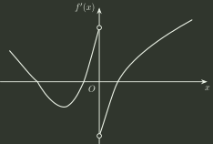

# q07_高等数学

## 📋 题目要求 (题面)

设函数 $f(x)$ 在 $(-\infty ,+\infty )$ 内连续，其导函数的图形如图所示，则 $f(x)$ 有

- **A.** 一个极小值点和两个极大值点．
- **B.** 两个极小值点和一个极大值点．
- **C.** 两个极小值点和两个极大值点．
- **D.** 三个极小值点和一个极大值点．

---

## 💡 答案与深度解析

**【正确答案】**：`C`

**正确答案：C**

**【解析】**

根据导函数的图形可知，一阶导数为零的点有 3 个； $x=0$ 是导数不存在的点。第一个交点左右两侧导数符号由正变为负，是极大值点；第二个交点和第三个交点左右两侧导数符号由负变为正，是极小值点。对导数不存在的点 $x=0$，左侧一阶导数为正，右侧一阶导数为负，可见 $x=0$ 为极大值点。故 $f(x)$ 共有两个极小值点和两个极大值点。
