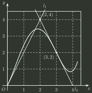

# 2005 年全国硕士研究生招生考试 数学（一）真题

## 一、填空题（第 1～6 小题，每小题 4 分，共 24 分）

### 1

曲线 $y=\frac{x^{2}}{2x+1}$ 的斜渐近线方程为 ______．

### 2

微分方程 $xy'+2y=x\ln x$ 满足 $y(1)=-\frac{1}{9}$ 的解为 ______．

### 3

设函数 $u(x,y,z)=1+\frac{x^{2}}{6}+\frac{y^{2}}{12}+\frac{z^{2}}{18}$， 单位向量 $\boldsymbol{n}=\frac{1}{\sqrt{3}}(1,1,1)$，则 $\left.\frac{\partial u}{\partial \boldsymbol{n}}\right|_{(1,2,3)}=$ ______．

### 4

设 $\Omega$ 是由锥面 $z=\sqrt{x^{2}+y^{2}}$ 与半球面 $z=\sqrt{R^{2}-x^{2}-y^{2}}$ 围成的空间区域， $\Sigma$ 是 $\Omega$ 的整个边界的外侧，则 $\iint _{\Sigma}x\,\mathrm{d}y\,\mathrm{d}z+y\,\mathrm{d}z\,\mathrm{d}x+z\,\mathrm{d}x\,\mathrm{d}y=$ ______．

### 5

设 $\alpha _{1},\alpha _{2},\alpha _{3}$ 均为3维列向量，记矩阵

$$
A=(\alpha _{1},\alpha _{2},\alpha _{3}),B=(\alpha _{1}+\alpha _{2}+\alpha _{3},\alpha _{1}+2\alpha _{2}+4\alpha _{3},\alpha _{1}+3\alpha _{2}+9\alpha _{3}),
$$

如果 $\lvert A\rvert=1$，那么 $\lvert B\rvert=$ ______．

### 6

从数 $1$ , $2$ , $3$ , $4$ 中任取一个数，记为 $X$，再从 $1,2,\cdots ,X$ 中任取一个数，记为 $Y$， 则 $P\{Y=2\}=$ ______．

## 二、单项选择题（第 7～14 小题，每小题 4 分，共 32 分）

### 7

设函数 $f(x)=\displaystyle\lim_{n\to\infty}\sqrt[n]{1+|x|^{3n}}$，则 $f(x)$ 在 $(-\infty,+\infty)$ 内

- **A.** 处处可导．
- **B.** 恰有一个不可导点．
- **C.** 恰有两个不可导点．
- **D.** 至少有三个不可导点．

### 8

设 $F(x)$ 是连续函数 $f(x)$ 的一个原函数，“$M\Leftrightarrow N$”表示“$M$ 的充分必要条件是 $N$”，则必有

- **A.** $F(x)$ 是偶函数 $⇔$ $f(x)$ 是奇函数．
- **B.** $F(x)$ 是奇函数 $⇔$ $f(x)$ 是偶函数．
- **C.** $F(x)$ 是周期函数 $⇔$ $f(x)$ 是周期函数．
- **D.** $F(x)$ 是单调函数 $⇔$ $f(x)$ 是单调函数．

### 9

设函数 $u(x,y)=\varphi(x+y)+\varphi(x-y)+\int_{x-y}^{x+y}\psi(t)\,dt$，其中函数 $\varphi$ 具有二阶导数，$\psi$ 具有一阶导数，则必有

- **A.** $\frac{\partial ^{2}u}{\partial x^{2}}=-\frac{\partial ^{2}u}{\partial y^{2}}$ ．
- **B.** $\frac{\partial ^{2}u}{\partial x^{2}}=\frac{\partial ^{2}u}{\partial y^{2}}$ ．
- **C.** $\frac{\partial ^{2}u}{\partial x\partial y}=\frac{\partial ^{2}u}{\partial y^{2}}$ ．
- **D.** $\frac{\partial ^{2}u}{\partial x\partial y}=\frac{\partial ^{2}u}{\partial x^{2}}$ ．

### 10

设有三元方程 $xy-z\ln y+\mathrm{e}^{xz}=1$，根据隐函数存在定理， 存在点 $(0,1,1)$ 的一个邻域，在此邻域内该方程

- **A.** 只能确定一个具有连续偏导数的隐函数 $z=z(x,y)$ ．
- **B.** 可确定两个具有连续偏导数的隐函数 $y=y(x,z)$ 和 $z=z(x,y)$ ．
- **C.** 可确定两个具有连续偏导数的隐函数 $x=x(y,z)$ 和 $z=z(x,y)$ ．
- **D.** 可确定两个具有连续偏导数的隐函数 $x=x(y,z)$ 和 $y=y(x,z)$ ．

### 11

设 $\lambda _{1},\lambda _{2}$ 是矩阵 $A$ 的两个不同的特征值，对应的特征向量分别为 $\alpha _{1},\alpha _{2}$， 则 $\alpha _{1}$， $A(\alpha _{1}+\alpha _{2})$ 线性无关的充分必要条件是

- **A.** $\lambda _{1}\ne 0$ ．
- **B.** $\lambda _{2}\ne 0$ ．
- **C.** $\lambda _{1}=0$ ．
- **D.** $\lambda _{2}=0$ ．

### 12

设 $A$ 为 $n$ ( $n\ge 2$ )阶可逆矩阵，交换 $A$ 的第 $1$ 行与第 $2$ 行得矩阵 $B$， $A^{*},B^{*}$ 分别为 $A,B$ 的伴随矩阵，则

- **A.** 交换 $A^{*}$ 的第 $1$ 列与第 $2$ 列得 $B^{*}$ ．
- **B.** 交换 $A^{*}$ 的第 $1$ 行与第 $2$ 行得 $B^{*}$ ．
- **C.** 交换 $A^{*}$ 的第 $1$ 列与第 $2$ 列得 $-B^{*}$ ．
- **D.** 交换 $A^{*}$ 的第 $1$ 行与第 $2$ 行得 $-B^{*}$ ．

### 13

设二维随机变量 $(X,Y)$ 的概率分布为

$$
\begin{array}{c|cc}
X\backslash Y&0&1\\ \hline
0&0.4&a\\
1&b&0.1
\end{array}
$$

已知随机事件 $\{X=0\}$ 与 $\{X+Y=1\}$ 相互独立，则

- **A.** $a=0.2,b=0.3$ ．
- **B.** $a=0.4,b=0.1$ ．
- **C.** $a=0.3,b=0.2$ ．
- **D.** $a=0.1,b=0.4$ ．

### 14

设 $X_{1},X_{2},\cdots ,X_{n}(n\ge 2)$ 为来自总体 $N(0,1)$ 的简单随机样本，$\bar X$ 为样本均值，$S^{2}$ 为样本方差，则

- **A.** $n\bar X\sim N(0,1)$ ．
- **B.** $nS^{2}\sim \chi^{2}(n)$ ．
- **C.** $\frac{(n-1)\bar X}{S}\sim t(n-1)$ ．
- **D.** $\frac{(n-1)X_{1}^{2}}{\sum _{i=2}^{n}X_{i}^{2}}\sim F(1,n-1)$ ．

## 三、解答题（第 15～23 小题，共 94 分）

### 15（本题满分 11 分）

设 $D=\{(x,y) \mid x^{2}+y^{2}\le \sqrt{2},x\ge 0,y\ge 0\}$， $[1+x^{2}+y^{2}]$ 表示不超过 $1+x^{2}+y^{2}$ 的最大整数． 计算二重积分 $\iint _{D}xy[1+x^{2}+y^{2}]\,\mathrm{d}x\,\mathrm{d}y$。

### 16（本题满分 12 分）

求幂级数 $\sum _{n=1}^{\infty}(-1)^{n-1}(1+\frac{1}{n(2n-1)})x^{2n}$ 的收敛区间与和函数 $f(x)$ ．

### 17（本题满分 11 分）

如图，曲线 $C$ 的方程为 $y=f(x)$，点 $(3,2)$ 是它的一个拐点， 直线 $l_{1}$ 与 $l_{2}$ 分别是曲线 $C$ 在点 $(0,0)$ 与 $(3,2)$ 处的切线， 其交点为 $(2,4)$ ． 设函数 $f(x)$ 具有三阶连续导数， 计算定积分 $\int _{0}^{3}(x^{2}+x)f'''(x)\,\mathrm{d}x$ ．

### 18（本题满分 12 分）

已知函数 $f(x)$ 在 $[0,1]$ 上连续，在 $(0,1)$ 内可导，且 $f(0)=0,f(1)=1$ ． 证明：

(1) 存在 $\xi \in (0,1),$ 使得 $f(\xi )=1-\xi$；

(2) 存在两个不同的点 $\eta,\zeta\in(0,1)$，使得 $f'(\eta)f'(\zeta)=1$ ．

### 19（本题满分 12 分）

设函数 $\varphi(y)$ 具有连续导数，在围绕原点的任意分段光滑简单闭曲线 $L$ 上，曲线积分 $\displaystyle\oint_L\frac{\varphi(y)\,dx+2xy\,dy}{2x^2+y^4}$ 的值恒为同一常数．

(1) 证明：对右半平面 $x>0$ 内的任意分段光滑简单闭曲线 $C$，有

$$
\oint_C\frac{\varphi(y)\,dx+2xy\,dy}{2x^2+y^4}=0.
$$

(2) 求函数 $\varphi(y)$ 的表达式．

### 20（本题满分 9 分）

已知二次型 $f(x_{1},x_{2},x_{3})=(1-a)x_{1}^{2}+(1-a)x_{2}^{2}+2x_{3}^{2}+2(1+a)x_{1}x_{2}$ 的秩为 $2$ ．

(1) 求 $a$ 的值；

(2) 求正交变换 $x=Qy$，把 $f(x_{1},x_{2},x_{3})$ 化成标准形；

(3) 求方程 $f(x_{1},x_{2},x_{3})=0$ 的解．

### 21（本题满分 9 分）

已知 $3$ 阶矩阵 $A$ 的第一行是 $(a,b,c)$， $a,b,c$ 不全为零，矩阵 $B=\begin{pmatrix} 1 & 2 & 3 \\ 2 & 4 & 6 \\ 3 & 6 & k \end{pmatrix}$ （$k$ 为常数），且 $AB=0$，求线性方程组 $Ax=0$ 的通解．

### 22（本题满分 9 分）

设二维随机变量 $(X,Y)$ 的概率密度为 $f(x,y)=\begin{cases} 1, & 0<x<1,0<y<2x, \\ 0, & 其他. \end{cases}$ 求：

(1) $(X,Y)$ 的边缘概率密度 $f_{X}(x),f_{Y}(y)$；

(2) $Z=2X-Y$ 的概率密度 $f_{Z}(z)$ ．

### 23（本题满分 9 分）

设 $X_{1},X_{2},\cdots ,X_{n}(n>2)$ 为来自总体 $N(0,1)$ 的简单随机样本，$\bar X$ 为样本均值，记 $Y_i=X_i-\bar X$，$i=1,2,\cdots,n$．求：

(1) $Y_i$ 的方差 $D(Y_i)$，$i=1,2,\cdots,n$；

(2) $Y_1$ 与 $Y_n$ 的协方差 $\operatorname{Cov}(Y_1,Y_n)$ ．

