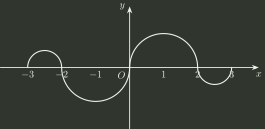

# q03_高等数学

## 📋 题目要求 (题面)

如图，连续函数 $y=f(x)$ 在区间 $[-3,-2]$、$[2,3]$ 上的图形分别是直径为 $1$ 的上、下半圆周，在区间 $[-2,0]$、$[0,2]$ 上的图形分别是直径为 $2$ 的下、上半圆周。

设 $F(x)=\int _{0}^{x}f(t)dt$，则下列结论正确的是

- **A.** $F(3)=-\frac{3}{4}F(-2)$ ．
- **B.** $F(3)=\frac{5}{4}F(2)$ ．
- **C.** $F(-3)=\frac{3}{4}F(2)$ ．
- **D.** $F(-3)=-\frac{5}{4}F(-2)$ ．

---

## 💡 答案与深度解析

**【正确答案】**：`C`

**正确答案：C**

**【解析】** 由所给条件知， $f(x)$ 为 $x$ 的奇函数，则 $f(-x)=-f(x)$，由 $F(x)=\int _{0}^{x}f(t)dt$ 知

$$
F(-x)=\int _{0}^{-x}f(t)dt=\int _{0}^{x}f(-u)d(-u)=\int _{0}^{x}f(u)du=F(x),
$$

故 $F(x)$ 为 $x$ 的偶函数，所以 $F(-3)=F(3)$。由于曲线由半圆周组成，由定积分的几何意义，得到

$$
F(2)=\int _{0}^{2}f(t)dt=\frac{\pi}{2}\cdot 1^{2}=\frac{\pi}{2},
$$

$$
F(3)=\int _{0}^{3}f(t)dt=\int _{0}^{2}f(t)dt+\int _{2}^{3}f(t)dt=\frac{\pi}{2}\cdot 1^{2}-\frac{\pi}{2}\cdot (\frac{1}{2})^{2}=\frac{\pi}{2}\cdot \frac{3}{4}=\frac{3}{4}F(2).
$$

所以 $F(-3)=F(3)=\frac{3}{4}F(2)$。
