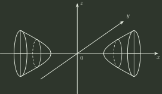

# q06_线性代数

## 📋 题目要求 (题面)

设二次型

$$
f(x,y,z)=X^TAX,
\qquad X=(x,y,z)^T,
$$

的图形如图，则 $A$ 的正特征值个数为（ ）

- **A.** $0$
- **B.** $1$
- **C.** $2$
- **D.** $3$

---

## 💡 答案与深度解析

**【正确答案】**：`B`

图示为双叶双曲面。经正交坐标变换后，它可写成

$$
\frac{u_1^2}{a^2}
-\frac{u_2^2}{b^2}
-\frac{u_3^2}{c^2}
=1.
$$

因此对应二次型的规范形有一个正平方项、两个负平方项，故正惯性指数为

$$
p=1.
$$

实对称矩阵 $A$ 的正特征值个数等于二次型的正惯性指数，所以

$$
\boxed{A\text{ 有 }1\text{ 个正特征值}}.
$$

故选 **B**。
