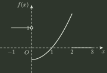
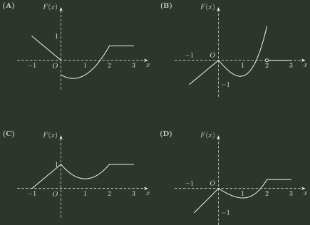

# 2009 年全国硕士研究生招生考试 数学（一）真题

## 一、单项选择题（第 1～8 小题，每小题 4 分，共 32 分）

### 1

当 $x\to 0$ 时， $f(x)=x-\sin ax$ 与 $g(x)=x^{2}\ln (1-bx)$ 等价无穷小，则

- **A.** $a=1,b=-\frac{1}{6}$
- **B.** $a=1,b=\frac{1}{6}$
- **C.** $a=-1,b=-\frac{1}{6}$
- **D.** $a=-1,b=\frac{1}{6}$

### 2

如图，正方形 $\{(x,y)||x|\le 1,|y|\le 1\}$ 被其对角线划分为四个区域 $D_{k}(k=1,2,3,4)$， $I_{k}=\iint _{D_{k}}y\cos xdxdy$，则 $\max _{1\le k\le 4}\{|I_{k}|\}=()$

- **A.** $I_{1}$
- **B.** $I_{2}$
- **C.** $I_{3}$
- **D.** $I_{4}$

### 3

设函数 $y=f(x)$ 在区间 $[-1,3]$ 上的图形如下图所示，则函数 $F(x)=\int_0^x f(t)\,dt$ 的图形为（ ）

- **A.** 见选项图示 (A)
- **B.** 见选项图示 (B)
- **C.** 见选项图示 (C)
- **D.** 见选项图示 (D)

### 4

设有两个数列 $\{a_{n}\}$， $\{b_{n}\}$，若 $\lim_{n\to \infty}a_{n}=0$，则

- **A.** 当 $\sum _{n=1}^{\infty}b_{n}$ 收敛时， $\sum _{n=1}^{\infty}a_{n}b_{n}$ 收敛
- **B.** 当 $\sum _{n=1}^{\infty}b_{n}$ 发散时， $\sum _{n=1}^{\infty}a_{n}b_{n}$ 发散
- **C.** 当 $\sum _{n=1}^{\infty}|b_{n}|$ 收敛时， $\sum _{n=1}^{\infty}a_{n}^{2}b_{n}^{2}$ 收敛
- **D.** 当 $\sum _{n=1}^{\infty}|b_{n}|$ 发散时， $\sum _{n=1}^{\infty}a_{n}^{2}b_{n}^{2}$ 发散

### 5

设 $\alpha _{1}$、 $\alpha _{2}$、 $\alpha _{3}$ 是 3 维向量空间 $R^{3}$ 的一组基，则由基 $\alpha _{1}$、 $\frac{1}{2}\alpha _{2}$、 $\frac{1}{3}\alpha _{3}$ 到基 $\alpha _{1}+\alpha _{2}$、 $\alpha _{2}+\alpha _{3}$、 $\alpha _{3}+\alpha _{1}$ 的过渡矩阵为

- **A.** $\begin{pmatrix} 1 & 0 & 1 \\ 2 & 2 & 0 \\ 0 & 3 & 3 \end{pmatrix}$
- **B.** $\begin{pmatrix} 1 & 2 & 0 \\ 0 & 2 & 3 \\ 1 & 0 & 3 \end{pmatrix}$
- **C.** $\begin{pmatrix} \frac{1}{2} & \frac{1}{4} & -\frac{1}{6} \\ -\frac{1}{2} & \frac{1}{4} & \frac{1}{6} \\ \frac{1}{2} & -\frac{1}{4} & \frac{1}{6} \end{pmatrix}$
- **D.** $\begin{pmatrix} \frac{1}{2} & -\frac{1}{2} & \frac{1}{2} \\ \frac{1}{4} & \frac{1}{4} & -\frac{1}{4} \\ -\frac{1}{6} & \frac{1}{6} & \frac{1}{6} \end{pmatrix}$

### 6

设 $A$， $B$ 均为 2 阶矩阵， $A^{∗}$， $B^{∗}$ 分别为 $A$， $B$ 的伴随矩阵。若 $|A|=2$， $|B|=3$，则分块矩阵 $\begin{pmatrix} O & A \\ B & O \end{pmatrix}$ 的伴随矩阵为

- **A.** $\begin{pmatrix} O & 3B^{∗} \\ 2A^{∗} & O \end{pmatrix}$
- **B.** $\begin{pmatrix} O & 2B^{∗} \\ 3A^{∗} & O \end{pmatrix}$
- **C.** $\begin{pmatrix} O & 3A^{∗} \\ 2B^{∗} & O \end{pmatrix}$
- **D.** $\begin{pmatrix} O & 2A^{∗} \\ 3B^{∗} & O \end{pmatrix}$

### 7

设随机变量 $X$ 的分布函数为 $F(x)=0.3\Phi (x)+0.7\Phi (\frac{x-1}{2})$，其中 $\Phi (x)$ 为标准正态分布函数，则 $EX=$

- **A.** $0$
- **B.** $0.3$
- **C.** $0.7$
- **D.** $1$

### 8

设随机变量 $X$ 与 $Y$ 相互独立，且 $X$ 服从标准正态分布 $N(0,1)$， $Y$ 的概率分布为 $P\{Y=0\}=P\{Y=1\}=\frac{1}{2}$，记 $F_{Z}(z)$ 为随机变量 $Z=XY$ 的分布函数，则函数 $F_{Z}(z)$ 的间断点个数为

- **A.** $0$
- **B.** $1$
- **C.** $2$
- **D.** $3$

## 二、填空题（第 9～14 小题，每小题 4 分，共 24 分）

### 9

设函数 $f(u,v)$ 具有二阶连续偏导数，$z=f(x,xy)$，则 $\frac{\partial^2z}{\partial x\partial y}=$

### 10

若二阶常系数线性齐次微分方程 $y''+ay'+by=0$ 的通解为 $y=(C_{1}+C_{2}x)e^{x}$，则非齐次方程 $y''+ay'+by=x$ 满足条件 $y(0)=2$， $y'(0)=0$ 的解为 $y=$

### 11

已知曲线 $L:y=x^{2} (0\le x\le \sqrt{2})$，则 $\int _{L}xds=$ ______

### 12

设 $\Omega =\{(x,y,z)|x^{2}+y^{2}+z^{2}\le 1\}$，则 $\iiint _{\Omega}z^{2}dxdydz=$

### 13

若 $3$ 维列向量 $\alpha$、 $\beta$ 满足 $\alpha ^{T}\beta =2$，其中 $\alpha ^{T}$ 为 $\alpha$ 的转置，则矩阵 $\beta \alpha ^{T}$ 的非零特征值为。

### 14

设 $X_{1}$， $X_{2}$， $\cdots$， $X_{m}$ 为来自二项分布总体 $B(n,p)$ 的简单随机样本， $\bar{X}$ 和 $S^{2}$ 分别为样本均值和样本方差，若 $\bar{X}+kS^{2}$ 为 $np^{2}$ 的无偏估计量，则 $k=$

## 三、解答题（第 15～23 小题，共 94 分）

### 15（本题满分 9 分）

求二元函数 $f(x,y)=x^{2}(2+y^{2})+y\ln y$ 的极值。

### 16（本题满分 9 分）

设 $a_{n}$ 为曲线 $y=x^{n}$ 与 $y=x^{n+1}$ （$n=1,2,\dots$）所围成区域的面积，记 $S_{1}=\sum _{n=1}^{\infty}a_{n}$， $S_{2}=\sum _{n=1}^{\infty}a_{2n-1}$，求 $S_{1}$ 与 $S_{2}$ 的值。

### 17（本题满分 11 分）

曲面 $S_{1}$ 是椭圆 $\frac{x^{2}}{4}+\frac{y^{2}}{3}=1$ 绕 $x$ 轴旋转而成，圆锥面 $S_{2}$ 是过点 $(4,0)$ 且与椭圆 $\frac{x^{2}}{4}+\frac{y^{2}}{3}=1$ 相切的直线绕 $x$ 轴旋转而成。

(I) 求 $S_{1}$ 及 $S_{2}$ 的方程；

(II) 求 $S_{1}$ 与 $S_{2}$ 之间的立体体积。

### 18（本题满分 11 分）

(I) 证明拉格朗日中值定理：若函数 $f(x)$ 在 $[a,b]$ 上连续，在 $(a,b)$ 内可导，则存在 $\xi \in (a,b)$，使得 $f(b)-f(a)=f'(\xi )(b-a)$。

(II) 证明：若函数 $f(x)$ 在 $x=0$ 处连续，在 $(0,\delta )(\delta >0)$ 内可导，且 $\lim _{x\to 0^{+}}f'(x)=A$，则 $f_{+}^{'}(0)$ 存在，且 $f_{+}^{'}(0)=A$。

### 19（本题满分 10 分）

计算曲面积分

$$
I=\iint_{\Sigma}\frac{x\,dy\,dz+y\,dz\,dx+z\,dx\,dy}{(x^2+y^2+z^2)^{3/2}},
$$

其中 $\Sigma$ 是曲面 $2x^2+2y^2+z^2=4$ 的外侧。

### 20（本题满分 11 分）

设 $A=\begin{pmatrix} 1 & -1 & -1 \\ -1 & 1 & 1 \\ 0 & -4 & -2 \end{pmatrix}$， $\xi _{1}=\begin{pmatrix} -1 \\ 1 \\ -2 \end{pmatrix}$。

(I) 求满足 $A\xi _{2}=\xi _{1}$ 的所有向量 $\xi _{2}$， $A^{2}\xi _{3}=\xi _{1}$ 的所有向量 $\xi _{3}$；

(II) 对 (I) 中的任意向量 $\xi _{2}$， $\xi _{3}$，证明 $\xi _{1}$， $\xi _{2}$， $\xi _{3}$ 线性无关。

### 21（本题满分 11 分）

设二次型

$$
f(x_{1},x_{2},x_{3})=ax_{1}^{2}+ax_{2}^{2}+(a-1)x_{3}^{2}+2x_{1}x_{3}-2x_{2}x_{3}
$$

（I）求二次型 $f$ 的矩阵的所有特征值； （II）若二次型 $f$ 的规范形为 $y_{1}^{2}+y_{2}^{2}$，求 $a$ 的值。

### 22（本题满分 11 分）

袋中有 $1$ 个红色球、 $2$ 个黑色球与 $3$ 个白球，现有放回地从袋中取两次，每次取一球，以 $X$、 $Y$、 $Z$ 分别表示两次取球所取得的红球、黑球与白球的个数。

(I) 求 $P\{X=1|Z=0\}$；

(II) 求二维随机变量 $(X,Y)$ 的概率分布。

### 23（本题满分 11 分）

设总体 $X$ 的概率密度为

$$
f(x)=\begin{cases} \lambda ^{2}xe^{-\lambda x}, & x>0 \\ 0, & 其他 \end{cases}
$$

其中参数 $\lambda (\lambda >0)$ 未知， $X_{1},X_{2},\cdots ,X_{n}$ 是来自总体 $X$ 的简单随机样本。

(I) 求参数 $\lambda$ 的矩估计量； (II) 求参数 $\lambda$ 的最大似然估计量。

