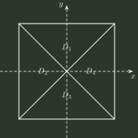

# q02_高等数学

## 📋 题目要求 (题面)

如图，正方形

$$
\{(x,y)\mid |x|\le1,\ |y|\le1\}
$$

被其对角线划分为四个区域 $D_k\ (k=1,2,3,4)$，记

$$
I_k=\iint_{D_k}y\cos x\,dx\,dy,
$$

则

$$
\max_{1\le k\le4}\{|I_k|\}=
$$

- **A.** $I_1$
- **B.** $I_2$
- **C.** $I_3$
- **D.** $I_4$

---

## 💡 答案与深度解析

**【正确答案】**：`A`

关键是同时利用**区域自身的对称性**和**上下区域之间的对称性**。

$D_2$、$D_4$ 各自关于 $x$ 轴对称，而

$$
y\cos x
$$

关于 $y$ 为奇函数，因此

$$
I_2=I_4=0.
$$

$D_1$ 位于上方，在该区域内 $y\ge0$，且 $|x|\le1$ 时 $\cos x>0$，所以

$$
I_1>0.
$$

又 $D_3$ 是 $D_1$ 关于 $x$ 轴的对称区域。作变换 $(x,y)\mapsto(x,-y)$，面积元不变而被积函数变号，故

$$
I_3=-I_1.
$$

于是

$$
|I_1|=|I_3|=I_1,
\qquad
|I_2|=|I_4|=0.
$$

因此

$$
\boxed{\max_{1\le k\le4}|I_k|=I_1},
$$

选 **A**。
