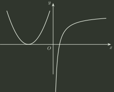

# 2015 年全国硕士研究生招生考试 数学（一）真题

## 一、单项选择题（第 1～8 小题，每小题 4 分，共 32 分）

### 1

设函数 $f(x)$ 在 $(-\infty ,+\infty )$ 上连续，其二阶导数 $f''(x)$ 的图形如右图所示，则曲线 $y=f(x)$ 在 $(-\infty ,+\infty )$ 的拐点个数为

- **A.** $0$
- **B.** $1$
- **C.** $2$
- **D.** $3$

### 2

设 $y=\frac{1}{2}e^{2x}+(x-\frac{1}{3})e^{x}$ 是二阶常系数非齐次线性微分方程 $y''+ay'+by=ce^{x}$ 的一个特解，则

- **A.** $a=-3,b=2,c=-1$
- **B.** $a=3,b=2,c=-1$
- **C.** $a=-3,b=2,c=1$
- **D.** $a=3,b=2,c=1$

### 3

若级数 $\sum _{n=1}^{\infty}a_{n}$ 条件收敛，则 $x=\sqrt{3}$ 与 $x=3$ 对于幂级数 $\sum _{n=1}^{\infty}na_{n}(x-1)^{n}$ 的

- **A.** 收敛点，收敛点
- **B.** 收敛点，发散点
- **C.** 发散点，收敛点
- **D.** 发散点，发散点

### 4

设 $D$ 是第一象限中由曲线 $2xy=1$， $4xy=1$ 与直线 $y=x$， $y=\sqrt{3}x$ 所围成的平面区域，函数 $f(x,y)$ 在 $D$ 上连续，则

$$
\iint _{D}f(x,y)dxdy
$$

化为极坐标下的二次积分是

- **A.** $\int _{\frac{\pi}{4}}^{\frac{\pi}{3}}d\theta \int _{\frac{1}{\sqrt{2sin2\theta}}}^{\frac{1}{\sqrt{sin2\theta}}}f(r\cos \theta ,r\sin \theta )rdr$
- **B.** $\int _{\frac{\pi}{4}}^{\frac{\pi}{3}}d\theta \int _{\frac{1}{\sqrt{sin2\theta}}}^{\frac{1}{\sqrt{2sin2\theta}}}f(r\cos \theta ,r\sin \theta )rdr$
- **C.** $\int _{\frac{\pi}{4}}^{\frac{\pi}{3}}d\theta \int _{\frac{1}{\sqrt{2sin\theta}}}^{\frac{1}{\sqrt{sin\theta}}}f(r\cos \theta ,r\sin \theta )dr$
- **D.** $\int _{\frac{\pi}{4}}^{\frac{\pi}{3}}d\theta \int _{\frac{1}{\sqrt{sin\theta}}}^{\frac{1}{\sqrt{2sin\theta}}}f(r\cos \theta ,r\sin \theta )dr$

### 5

设矩阵 $A=\begin{pmatrix} 1 & 1 & 1 \\ 1 & 2 & a \\ 1 & 4 & a^{2} \end{pmatrix}$， $b=\begin{pmatrix} 1 \\ d \\ d^{2} \end{pmatrix}$，若集合 $\Omega =\{1,2\}$，则线性方程组 $Ax=b$ 有无穷多解的充分必要条件是

- **A.** $a\notin\Omega$ 且 $d\notin\Omega$
- **B.** $a\notin\Omega$ 且 $d\in\Omega$
- **C.** $a\in\Omega$ 且 $d\notin\Omega$
- **D.** $a\in\Omega$ 且 $d\in\Omega$

### 6

设二次型 $f(x_{1},x_{2},x_{3})$ 在正交变换 $x=Py$ 下的标准形为 $2y_{1}^{2}+y_{2}^{2}-y_{3}^{2}$，其中 $P=(e_{1},e_{2},e_{3})$，若 $Q=(e_{1},-e_{3},e_{2})$，则 $f(x_{1},x_{2},x_{3})$ 在 $x=Qy$ 下的标准形为

- **A.** $2y_{1}^{2}-y_{2}^{2}+y_{3}^{2}$
- **B.** $2y_{1}^{2}+y_{2}^{2}-y_{3}^{2}$
- **C.** $2y_{1}^{2}-y_{2}^{2}-y_{3}^{2}$
- **D.** $2y_{1}^{2}+y_{2}^{2}+y_{3}^{2}$

### 7

若 $A$， $B$ 为任意两个随机事件，则

- **A.** $P(AB)\le P(A)P(B)$
- **B.** $P(AB)\ge P(A)P(B)$
- **C.** $P(AB)\le \frac{P(A)+P(B)}{2}$
- **D.** $P(AB)\ge \frac{P(A)+P(B)}{2}$

### 8

设随机变量 $X$、 $Y$ 不相关，且 $EX=2$， $EY=1$， $DX=3$，则 $E(X(X+Y-2))=()$。

- **A.** $-3$
- **B.** $3$
- **C.** $-5$
- **D.** $5$

## 二、填空题（第 9～14 小题，每小题 4 分，共 24 分）

### 9

$\displaystyle \lim_{x\to0}\frac{\ln(\cos x)}{x^2}=$ ______

### 10

$\displaystyle \int_{-\pi/2}^{\pi/2}\left(\frac{\sin x}{1+\cos x}+|x|\right)dx=$ ______．

### 11

若函数 $z=z(x,y)$ 是由方程 $e^{z}+xyz+x+\cos x=2$ 确定，则 $dz|_{(0,1)}=$

### 12

设 $\Omega$ 是由平面 $x+y+z=1$ 和三个坐标面围成的空间区域，则

$$
\iiint _{\Omega}(x+2y+3z)dxdydz=
$$

### 13

$n$ 阶行列式 $\begin{vmatrix} 2 & 0 & \cdots & 0 & 2 \\ -1 & 2 & \cdots & 0 & 2 \\ \vdots & \ddots & \ddots & \vdots & \vdots \\ 0 & 0 & \cdots & 2 & 2 \\ 0 & 0 & \cdots & -1 & 2 \end{vmatrix}=$

### 14

设二维随机变量 $(X,Y)$ 服从正态分布 $N(1,0;1,1;0)$，则 $P\{XY-Y<0\}=$

## 三、解答题（第 15～23 小题，共 94 分）

### 15（本题满分 10 分）

设函数 $f(x)=x+a\ln (1+x)+bx\sin x$， $g(x)=kx^{3}$ 在 $x\to 0$ 时为等价无穷小，求常数 $a,b,k$ 的取值。

### 16（本题满分 10 分）

设函数 $y=f(x)$ 在定义域 $I$ 上的导数大于零，若对任意的 $x_{0}\in I$，曲线 $y=f(x)$ 在点 $(x_{0},f(x_{0}))$ 处的切线与直线 $x=x_{0}$ 及 $x$ 轴所围成区域的面积恒为 4，且 $f(0)=2$，求 $f(x)$ 的表达式。

### 17（本题满分 10 分）

设函数 $f(x,y)=x+y+xy$，曲线 $C:x^{2}+y^{2}+xy=3$，求 $f(x,y)$ 在曲线 $C$ 上的最大方向导数。

### 18（本题满分 10 分）

(1) 设函数 $u(x)$， $v(x)$ 都可导，利用导数定义证明 $(u(x)v(x))'=u'(x)v(x)+u(x)v'(x)$；

(2) 设函数 $u_{1}(x)$， $u_{2}(x)$， $\cdots$， $u_{n}(x)$ 都可导， $f(x)=u_{1}(x)u_{2}(x)\cdots u_{n}(x)$，写出 $f(x)$ 的求导公式。

### 19（本题满分 10 分）

已知曲线 $L$ 的方程为

$$
\begin{cases} z=\sqrt{2-x^{2}-y^{2}} \\ z=x \end{cases}
$$

起点为 $A(0,\sqrt{2},0)$，终点为 $B(0,-\sqrt{2},0)$，计算曲线积分

$$
\int _{L}(y+z)dx+(z^{2}-x^{2}+y)dy+(x^{2}+y^{2})dz
$$

### 20（本题满分 11 分）

设向量组 $\alpha _{1}$， $\alpha _{2}$， $\alpha _{3}$ 为向量空间 $R^{3}$ 的一组基， $\beta _{1}=2\alpha _{1}+2k\alpha _{3}$， $\beta _{2}=2\alpha _{2}$， $\beta _{3}=\alpha _{1}+(k+1)\alpha _{3}$。

(1) 证明：向量组 $\beta _{1}$， $\beta _{2}$， $\beta _{3}$ 为向量空间 $R^{3}$ 的一组基；

(2) 当 $k$ 为何值时，存在非零向量 $\xi$，使得 $\xi$ 在基 $\alpha _{1}$， $\alpha _{2}$， $\alpha _{3}$ 和基 $\beta _{1}$， $\beta _{2}$， $\beta _{3}$ 下的坐标相同，并求出所有的非零向量。

### 21（本题满分 11 分）

已知矩阵 $A=\begin{pmatrix} 0 & 2 & -3 \\ -1 & 3 & -3 \\ 1 & -2 & a \end{pmatrix}$ 与 $B=\begin{pmatrix} 1 & -2 & 0 \\ 0 & b & 0 \\ 0 & 3 & 1 \end{pmatrix}$ 相似。

(1) 求 $a$， $b$ 的值；

(2) 求可逆矩阵 $P$，使 $P^{-1}AP$ 为对角矩阵。

### 22（本题满分 11 分）

设 $f(x)=\begin{cases} 2^{-x}\ln 2, & x>0 \\ 0, & x\le 0 \end{cases}$，对 $X$ 进行独立重复的观测，直到第 2 个大于 3 的观测值出现时停止，记 $Y$ 为观测次数。求：

(1) 求 $Y$ 的概率分布；

(2) 求数学期望 $E(Y)$。

### 23（本题满分 11 分）

设总体 $X$ 的概率密度为

$$
f(x;\theta)=\begin{cases}\dfrac1{1-\theta},&\theta\le x\le1,\\0,&\text{其他}.\end{cases}
$$

其中 $\theta<1$ 为未知参数，$X_1,X_2,\cdots,X_n$ 是来自总体 $X$ 的简单随机样本。

（Ⅰ）求参数 $\theta$ 的矩估计量；

（Ⅱ）求参数 $\theta$ 的最大似然估计量。

