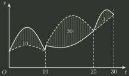

# 2017 年全国硕士研究生招生考试 数学（一）真题

## 一、单项选择题（第 1～8 小题，每小题 4 分，共 32 分）

### 1

若函数 $f(x)=\begin{cases} \dfrac{1-\cos\sqrt{x}}{ax}, & x>0, \\ b, & x\le0 \end{cases}$ 在 $x=0$ 处连续，则（ ）

- **A.** $ab=\frac{1}{2}$
- **B.** $ab=-\frac{1}{2}$
- **C.** $ab=0$
- **D.** $ab=2$

### 2

设函数 $f(x)$ 可导，且 $f(x)f'(x)>0$，则（）

- **A.** $f(1)>f(-1)$ ．
- **B.** $f(1)<f(-1)$ ．
- **C.** $|f(1)|>|f(-1)|$ ．
- **D.** $|f(1)|<|f(-1)|$ ．

### 3

函数 $f(x,y,z)=x^{2}y+z^{2}$ 在点 $(1,2,0)$ 处沿向量 $n=(1,2,2)$ 的方向导数为( )

- **A.** $12$
- **B.** $6$
- **C.** $4$
- **D.** $2$

### 4

甲、乙两人赛跑，计时开始时，甲在乙前方 10（单位：m）处，图中，实线表示甲的速度曲线 $v=v_{1}(t)$ （单位：m/s），虚线表示乙的速度曲线 $v=v_{2}(t)$，三块阴影部分面积的数值依次是 10,20,3。计时开始后乙追上甲的时刻记为 $t_{0}$ （单位：s），则（）

- **A.** $t_{0}=10$
- **B.** $15<t_{0}<20$
- **C.** $t_{0}=25$
- **D.** $t_{0}>25$

### 5

设 $\alpha$ 为 $n$ 维单位列向量， $E$ 为 $n$ 阶单位矩阵，则（）

- **A.** $E-\alpha \alpha ^{T}$ 不可逆。
- **B.** $E+\alpha \alpha ^{T}$ 不可逆。
- **C.** $E+2\alpha \alpha ^{T}$ 不可逆。
- **D.** $E-2\alpha \alpha ^{T}$ 不可逆。

### 6

已知矩阵 $A=\begin{pmatrix} 2 & 0 & 0 \\ 0 & 2 & 1 \\ 0 & 0 & 1 \end{pmatrix}$ , $B=\begin{pmatrix} 2 & 1 & 0 \\ 0 & 2 & 0 \\ 0 & 0 & 1 \end{pmatrix}$ , $C=\begin{pmatrix} 1 & 0 & 0 \\ 0 & 2 & 0 \\ 0 & 0 & 2 \end{pmatrix}$ , 则( )

- **A.** $A$ 与 $C$ 相似， $B$ 与 $C$ 相似。
- **B.** $A$ 与 $C$ 相似， $B$ 与 $C$ 不相似。
- **C.** $A$ 与 $C$ 不相似， $B$ 与 $C$ 相似。
- **D.** $A$ 与 $C$ 不相似， $B$ 与 $C$ 不相似。

### 7

设 $A,B$ 为随机事件。若 $0<P(A)<1,0<P(B)<1$，则 $P(A\mid B)>P(A\mid\overline B)$ 的充分必要条件是（ ）

- **A.** $P(B\mid A)>P(B\mid\overline A)$
- **B.** $P(B\mid A)<P(B\mid\overline A)$
- **C.** $P(\overline B\mid A)>P(B\mid\overline A)$
- **D.** $P(\overline B\mid A)<P(B\mid\overline A)$

### 8

设 $X_1,X_2,\cdots,X_n\ (n\ge2)$ 为来自总体 $N(\mu,1)$ 的简单随机样本，记 $\bar X=\frac1n\sum_{i=1}^nX_i$，则下列结论中不正确的是（）

- **A.** $\sum _{i=1}^{n}(X_{i}-\mu )^{2}$ 服从 $χ^{2}$ 分布。
- **B.** $2(X_{n}-X_{1})^{2}$ 服从 $χ^{2}$ 分布。
- **C.** $\sum_{i=1}^{n}(X_i-\bar X)^2$ 服从 $\chi^2$ 分布。
- **D.** $n(\bar X-\mu)^2$ 服从 $\chi^2$ 分布。

## 二、填空题（第 9～14 小题，每小题 4 分，共 24 分）

### 9

已知函数 $f(x)=\frac{1}{1+x^{2}}$，则 $f^{(3)}(0)=$ ______．

### 10

微分方程 $y''+2y'+3y=0$ 的通解为 $y=$ ______．

### 11

若曲线积分 $\int _{L}\frac{xdx-aydy}{x^{2}+y^{2}-1}$ 在区域 $D=\{(x,y)|x^{2}+y^{2}<1\}$ 内与路径无关，则 $a=$ ______．

### 12

幂级数 $\sum _{n=1}^{\infty}(-1)^{n-1}nx^{n-1}$ 在区间 $(-1,1)$ 内的和函数 $S(x)=$ ______．

### 13

设矩阵 $A=\begin{pmatrix} 1 & 0 & 1 \\ 1 & 1 & 2 \\ 0 & 1 & 1 \end{pmatrix},$ $\alpha _{1},\alpha _{2},\alpha _{3}$ 为线性无关的 $3$ 维列向量组，则向量组 $A\alpha _{1},A\alpha _{2},A\alpha _{3}$ 的秩为______．

### 14

设随机变量 $X$ 的分布函数为 $F(x)=0.5\Phi (x)+0.5\Phi (\frac{x-4}{2})$，其中 $\Phi (x)$ 为标准正态分布函数，则 $E(X)=$ ______．

## 三、解答题（第 15～23 小题，共 94 分）

### 15（本题满分 10 分）

设函数 $f(u,v)$ 具有 2 阶连续偏导数， $y=f(e^{x},\cos x)$，求 $\frac{dy}{dx} \mid _{x=0}$， $\frac{d^{2}y}{dx^{2}} \mid _{x=0}$ ．

### 16（本题满分 10 分）

$$
\lim_{n\to \infty}\sum_{k=1}^{n}\frac{k}{n^{2}}\ln (1+\frac{k}{n})=
$$

### 17（本题满分 10 分）

已知函数 $y(x)$ 由方程 $x^{3}+y^{3}-3x+3y-2=0$ 确定，求 $y(x)$ 的极值。

### 18（本题满分 10 分）

设函数 $f(x)$ 在区间 $[0,1]$ 上具有 2 阶导数，且 $f(1)>0,\lim_{x\to 0^{+}}\frac{f(x)}{x}<0$ 证明：

(Ⅰ)方程 $f(x)=0$ 在区间 $(0,1)$ 内至少存在一个实根；

(Ⅱ)方程 $f(x)f''(x)+[f'(x)]^{2}=0$ 在区间 $(0,1)$ 内至少存在两个不同实根。

### 19（本题满分 10 分）

设薄片型物体 $S$ 是圆锥面 $z=\sqrt{x^{2}+y^{2}}$ 被柱面 $z^{2}=2x$ 割下的有限部分，其上任一点的密度为 $\mu (x,y,z)=9\sqrt{x^{2}+y^{2}+z^{2}}$。记圆锥面与柱面的交线为 C。

(Ⅰ)求 $C$ 在 $xOy$ 平面上的投影曲线的方程；

(Ⅱ)求 $S$ 的质量 $M$。

### 20（本题满分 11 分）

设 3 阶矩阵 $A=(\alpha _{1},\alpha _{2},\alpha _{3})$ 有 3 个不同的特征值，且 $\alpha _{3}=\alpha _{1}+2\alpha _{2}$。

(Ⅰ) 证明 $r(A)=2$；

(Ⅱ) 设 $\beta =\alpha _{1}+\alpha _{2}+\alpha _{3}$，求方程组 $Ax=\beta$ 的通解。

### 21（本题满分 11 分）

设二次型 $f(x_{1},x_{2},x_{3})=2x_{1}^{2}-x_{2}^{2}+ax_{3}^{2}+2x_{1}x_{2}-8x_{1}x_{3}+2x_{2}x_{3}$ 在正交变换 $x=Qy$ 下的标准形为 $\lambda _{1}y_{1}^{2}+\lambda _{2}y_{2}^{2}$，求 $a$ 的值及一个正交矩阵 $Q$ ．

### 22（本题满分 11 分）

设随机变量 $X$， $Y$ 相互独立，且 $X$ 的概率分布为 $P\{X=0\}=P\{X=2\}=\frac{1}{2}$， $Y$ 的概率密度为

$$
f(y)=\begin{cases} 2y, & 0<y<1, \\ 0, & 其他 \end{cases}
$$

(Ⅰ) 求 $P\{Y\le E(Y)\}$；

(Ⅱ) 求 $Z=X+Y$ 的概率密度。

### 23（本题满分 11 分）

某工程师为了解一台天平的精度，用该天平对一物体的质量做 $n$ 次测量，该物体的质量 $\mu$ 是已知的。设 $n$ 次测量结果 $X_{1},X_{2},\cdots ,X_{n}$ 相互独立且均服从正态分布 $N(\mu ,\sigma ^{2})$，该工程师记录的是 $n$ 次测量的绝对误差 $Z_{i}=|X_{i}-\mu | (i=1,2,\cdots ,n)$。利用 $Z_{1},Z_{2},\cdots ,Z_{n}$ 估计 $\sigma$。

(Ⅰ) 求 $Z_{1}$ 的概率密度；

(Ⅱ) 利用一阶矩求 $\sigma$ 的矩估计量；

(Ⅲ) 求 $\sigma$ 的最大似然估计量。

