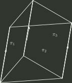

# 2019 年全国硕士研究生招生考试 数学（一）真题

## 一、单项选择题（第 1～8 小题，每小题 4 分，共 32 分）

### 1

当 $x\to 0$ 时，若 $x-\tan x$ 与 $x^{k}$ 是同阶无穷小，则 $k=$

- **A.** $1$
- **B.** $2$
- **C.** $3$
- **D.** $4$

### 2

设函数 $f(x)=\begin{cases} x|x|, & x\le 0 \\ x\ln x, & x>0 \end{cases}$ 则 $x=0$ 是 $f(x)$ 的

- **A.** 可导点，极值点。
- **B.** 不可导点，极值点。
- **C.** 可导点，非极值点。
- **D.** 不可导点，非极值点

### 3

设 $\{u_{n}\}$ 是单调递增的有界数列，则下列级数中收敛的是

- **A.** $\sum _{n=1}^{\infty}\frac{u_{n}}{n}$
- **B.** $\sum _{n=1}^{\infty}(-1)^{n}\frac{1}{u_{n}}$
- **C.** $\sum _{n=1}^{\infty}(1-\frac{u_{n}}{u_{n+1}})$
- **D.** $\sum _{n=1}^{\infty}(u_{n+1}^{2}-u_{n}^{2})$

### 4

设函数 $Q(x,y)=\frac{x}{y^{2}}$，如果对上半平面 $(y>0)$ 内的任意有向光滑封闭曲线 C 都有 $\oint _{C}P(x,y)dx+Q(x,y)dy=0$ ,那么函数 $P(x,y)$ 可取为

- **A.** $y-\frac{x^{2}}{y^{3}}$
- **B.** $\frac{1}{y}-\frac{x^{2}}{y^{3}}$
- **C.** $\frac{1}{x}-\frac{1}{y}$
- **D.** $x-\frac{1}{y}$

### 5

设 A 是 3 阶实对称矩阵，E 是 3 阶单位矩阵，若 $A^{2}+A=2E$ ,且 $|A|=4$ ,则二次型 $x^{T}Ax$ 的规范形为

- **A.** $y_{1}^{2}+y_{2}^{2}+y_{3}^{2}$
- **B.** $y_{1}^{2}+y_{2}^{2}-y_{3}^{2}$
- **C.** $y_{1}^{2}-y_{2}^{2}-y_{3}^{2}$
- **D.** $-y_{1}^{2}-y_{2}^{2}-y_{3}^{2}$

### 6

如图所示，有 3 张平面两两相交，交线相互平行，它们的方程 $a_{i1}x+a_{i2}y+a_{i3}z=d_{i}(i=1,2,3)$ 组成的线性方程组的系数矩阵和增广矩阵分别记为 $A$、 $\bar{A}$，则

- **A.** $r(A)=2,\ r(\bar A)=3$
- **B.** $r(A)=2,\ r(\bar A)=2$
- **C.** $r(A)=1,\ r(\bar A)=2$
- **D.** $r(A)=1,\ r(\bar A)=1$

### 7

设 A , B 为随机事件，则 $P(A)=P(B)$ 的充分必要条件是

- **A.** $P(A\cup B)=P(A)+P(B)$
- **B.** $P(A\cap B)=P(A)P(B)$
- **C.** $P(A\cap B^c)=P(A^c\cap B)$
- **D.** $P(A\cap B)=P(A^c\cap B^c)$

### 8

设随机变量 $X$ 与 $Y$ 相互独立，且都服从正态分布 $N(\mu ,\sigma ^{2})$，则 $P\{|X-Y|<1\}$

- **A.** 与 $\mu$ 无关，而与 $\sigma ^{2}$ 有关。
- **B.** 与 $\mu$ 有关，而与 $\sigma ^{2}$ 无关
- **C.** 与 $\mu ,\sigma ^{2}$ 都有关。
- **D.** 与 $\mu ,\sigma ^{2}$ 都无关。

## 二、填空题（第 9～14 小题，每小题 4 分，共 24 分）

### 9

设函数 $f(u)$ 可导，$z=f(\sin y-\sin x)+xy$，则 $\frac{1}{\cos x}\cdot \frac{\partial z}{\partial x}+\frac{1}{\cos y}\cdot \frac{\partial z}{\partial y}=$

### 10

微分方程 $2yy'-y^{2}-2=0$ 满足条件 $y(0)=1$ 的特解 $y=$

### 11

求级数 $\sum _{n=0}^{\infty}\frac{(-1)^{n}}{(2n)!}x^{n}$ 在 $(0,+\infty )$ 内的和函数 $S(x)=$

### 12

设 $\Sigma$ 为曲面 $x^{2}+y^{2}+4z^{2}=4\ (z\ge 0)$ 的上侧，则 $\iint _{\Sigma}\sqrt{4-x^{2}-4z^{2}}dxdy=$

### 13

设 $A=(\alpha _{1},\alpha _{2},\alpha _{3})$ 为三阶矩阵，若 $\alpha _{1}$， $\alpha _{2}$ 线性无关，且 $\alpha _{3}=-\alpha _{1}+2\alpha _{2}$，则线性方程组 $Ax=0$ 的通解为

### 14

设 $f(x)=\begin{cases} \frac{x}{2}, & 0<x<2 \\ 0, & 其他 \end{cases}$， $F(x)$ 为 $X$ 的分布函数， $EX$ 为 $X$ 的数学期望，则 $P\{F(X)>EX-1\}=$

## 三、解答题（第 15～23 小题，共 94 分）

### 15（本题满分 10 分）

设函数 $y(x)$ 是微分方程 $y'+xy=e^{-\frac{x^{2}}{2}}$ 满足条件 $y(0)=0$ 的特解。

(Ⅰ) 求 $y(x)$；

(Ⅱ) 求曲线 $y=y(x)$ 的凹凸区间及拐点。

### 16（本题满分 10 分）

设 $a$， $b$ 为实数，函数 $z=2+ax^{2}+by^{2}$ 在点 $(3,4)$ 处的方向导数中，沿方向 $l=-3i-4j$ 的方向导数最大，最大值为 $10$。

（Ⅰ）求 $a$， $b$；

（Ⅱ）求曲面 $z=2+ax^{2}+by^{2} (z\ge 0)$ 的面积。

### 17（本题满分 10 分）

求曲线 $y=e^{-x}\sin x (x\ge 0)$ 与 $x$ 轴之间图形的面积。

### 18（本题满分 10 分）

设 $a_{n}=\int _{0}^{1}x^{n}\sqrt{1-x^{2}}dx(n=0,1,2,\cdots )$ ．

（Ⅰ）证明数列 $\{a_{n}\}$ 单调递减，且 $a_{n}=\frac{n-1}{n+2}a_{n-2}(n=2,3,\cdots )$；

（Ⅱ）求 $\lim_{n\to \infty}\frac{a_{n}}{a_{n-1}}$ ．

### 19（本题满分 10 分）

设 $\Omega$ 是由锥面 $x^{2}+(y-z)^{2}=(1-z)^{2}(0\le z\le 1)$ 与平面 $z=0$ 围成的锥体，求 $\Omega$ 的形心坐标。

### 20（本题满分 11 分）

设向量组 $\alpha _{1}=(1,2,1)^{T}$， $\alpha _{2}=(1,3,2)^{T}$， $\alpha _{3}=(1,a,3)^{T}$ 为 $R^{3}$ 的一个基， $\beta =(1,1,1)^{T}$ 在这个基下的坐标为 $(b,c,1)^{T}$。

（Ⅰ）求 $a,b,c$；

（Ⅱ）证明 $\alpha _{2},\alpha _{3},\beta$ 为 $R^{3}$ 的一个基，并求 $\alpha _{2},\alpha _{3},\beta$ 到 $\alpha _{1},\alpha _{2},\alpha _{3}$ 的过渡矩阵。

### 21（本题满分 11 分）

已知矩阵 $A=\begin{pmatrix} -2 & -2 & 1 \\ 2 & x & -2 \\ 0 & 0 & -2 \end{pmatrix}$ 与 $B=\begin{pmatrix} 2 & 1 & 0 \\ 0 & -1 & 0 \\ 0 & 0 & y \end{pmatrix}$ 相似。

(Ⅰ) 求 $x,y$；

(Ⅱ) 求可逆矩阵 $P$ 使得 $P^{-1}AP=B$。

### 22（本题满分 11 分）

设随机变量 $X$ 与 $Y$ 相互独立， $X$ 服从参数为 $1$ 的指数分布， $Y$ 的概率分布为 $P\{Y=-1\}=p$， $P\{Y=1\}=1-p (0<p<1)$，令 $Z=XY$。

(Ⅰ) 求 $Z$ 的概率密度；

(Ⅱ) $p$ 为何值时， $X$ 与 $Z$ 不相关；

(Ⅲ) $X$ 与 $Z$ 是否相互独立？

### 23（本题满分 11 分）

设总体 $X$ 的概率密度为

$$
f(x;\sigma ^{2})=\begin{cases} \frac{A}{\sigma}e^{-\frac{(x-\mu )^{2}}{2\sigma ^{2}}}, x\ge \mu , \\ 0, x<\mu , \end{cases}
$$

其中 $\mu$ 是已知参数， $\sigma >0$ 是未知参数， $A$ 是常数。 $X_{1},X_{2},\cdots ,X_{n}$ 是来自总体 $X$ 的简单随机样本。

（Ⅰ）求 $A$；

（Ⅱ）求 $\sigma ^{2}$ 的最大似然估计量。

