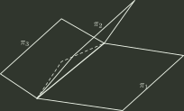

# 2024 年全国硕士研究生招生考试 数学（一）真题

## 一、单项选择题（第 1～10 小题，每小题 5 分，共 50 分）

### 1

已知函数 $f(x)=\int_{0}^{x}\mathrm{e}^{\cos t}\,\mathrm{d}t$，$g(x)=\int_{0}^{\sin x}\mathrm{e}^{t^{2}}\,\mathrm{d}t$，则（ ）

- **A.** $f(x)$ 是奇函数， $g(x)$ 是偶函数
- **B.** $f(x)$ 是偶函数， $g(x)$ 是奇函数
- **C.** $f(x)$ 与 $g(x)$ 均为奇函数
- **D.** $f(x)$ 与 $g(x)$ 均为周期函数

### 2

已知 $P=P(x,y,z)$，$Q=Q(x,y,z)$ 均为连续函数，$\Sigma$ 为曲面 $z=\sqrt{1-x^{2}-y^{2}}\ (x\le 0,\ y\ge 0)$ 的上侧，则

$$
\iint_{\Sigma}P\,\mathrm{d}y\,\mathrm{d}z+Q\,\mathrm{d}z\,\mathrm{d}x=
$$

- **A.** $\displaystyle \iint_{\Sigma}\left(\frac{x}{z}P+\frac{y}{z}Q\right)\,\mathrm{d}x\,\mathrm{d}y$
- **B.** $\displaystyle \iint_{\Sigma}\left(-\frac{x}{z}P+\frac{y}{z}Q\right)\,\mathrm{d}x\,\mathrm{d}y$
- **C.** $\displaystyle \iint_{\Sigma}\left(\frac{x}{z}P-\frac{y}{z}Q\right)\,\mathrm{d}x\,\mathrm{d}y$
- **D.** $\displaystyle \iint_{\Sigma}\left(-\frac{x}{z}P-\frac{y}{z}Q\right)\,\mathrm{d}x\,\mathrm{d}y$

### 3

已知幂级数 $\sum_{n=0}^{\infty}a_nx^n$ 的和函数为 $\ln(2+x)$，则 $\sum_{n=1}^{\infty}na_{2n}=$（ ）

- **A.** $-\frac{1}{6}$
- **B.** $-\frac{1}{3}$
- **C.** $\frac{1}{6}$
- **D.** $\frac{1}{3}$

### 4

设函数 $f(x)$ 在区间 $(-1,1)$ 上有定义，且 $\lim_{x\to 0}f(x)=0$，则（ ）

- **A.** 当 $\lim_{x\to 0}\frac{f(x)}{x}=m$ 时， $f'(0)=m$
- **B.** 当 $f'(0)=m$ 时， $\lim_{x\to 0}\frac{f(x)}{x}=m$
- **C.** 当 $\lim_{x\to 0}f'(x)=m$ 时， $f'(0)=m$
- **D.** 当 $f'(0)=m$ 时， $\lim_{x\to 0}f'(x)=m$

### 5

在空间直角坐标系 $O-xyz$ 中，三张平面 $\pi _{i}:a_{i}x+b_{i}y+c_{i}z=d_{i}(i=1,2,3)$ 的位置关系如图所示，

记 $\alpha _{i}=(a_{i},b_{i},c_{i})$， $\beta _{i}=(a_{i},b_{i},c_{i},d_{i})$， 若

$$
r\begin{pmatrix} \alpha _{1} \\ \alpha _{2} \\ \alpha _{3} \end{pmatrix}=m,r\begin{pmatrix} \beta _{1} \\ \beta _{2} \\ \beta _{3} \end{pmatrix}=n,
$$

则（）

- **A.** $m=1$， $n=2$
- **B.** $m=n=2$
- **C.** $m=2$， $n=3$
- **D.** $m=n=3$

### 6

设向量 $\alpha _{1}=\begin{pmatrix} a \\ 1 \\ -1 \\ 1 \end{pmatrix}$， $\alpha _{2}=\begin{pmatrix} 1 \\ 1 \\ b \\ a \end{pmatrix}$， $\alpha _{3}=\begin{pmatrix} 1 \\ a \\ -1 \\ 1 \end{pmatrix}$，若 $\alpha _{1},\alpha _{2},\alpha _{3}$ 线性相关，且其中任意两个向量均线性无关，则（）

- **A.** $a=1,b\ne -1$
- **B.** $a=1,b=-1$
- **C.** $a\ne -2,b=2$
- **D.** $a=-2,b=2$

### 7

设 $\boldsymbol{A}$ 是秩为 $2$ 的 $3$ 阶矩阵，$\boldsymbol{\alpha}$ 是满足 $\boldsymbol{A}\boldsymbol{\alpha}=\boldsymbol{0}$ 的非零向量。若对满足 $\boldsymbol{\beta}^{\mathrm{T}}\boldsymbol{\alpha}=0$ 的任意 $3$ 维列向量 $\boldsymbol{\beta}$，均有 $\boldsymbol{A}\boldsymbol{\beta}=\boldsymbol{\beta}$，则（ ）

- **A.** $A^{3}$ 的迹为 $2$
- **B.** $A^{3}$ 的迹为 $5$
- **C.** $A^{2}$ 的迹为 $8$
- **D.** $A^{2}$ 的迹为 $9$

### 8

设随机变量 $X$、$Y$ 相互独立，且 $X$ 服从正态分布 $N(0,2)$，$Y$ 服从正态分布 $N(-2,2)$。若 $P\{2X+Y<a\}=P\{X>Y\}$，则 $a=$（ ）

- **A.** $-2-\sqrt{10}$
- **B.** $-2+\sqrt{10}$
- **C.** $-2-\sqrt{6}$
- **D.** $-2+\sqrt{6}$

### 9

设随机变量 $X$ 的概率密度为

$$
f(x)=\begin{cases} 2(1-x), & 0<x<1 \\ 0, & 其它 \end{cases}
$$

在 $X=x (0<x<1)$ 的条件下，随机变量 $Y$ 服从区间 $(x,1)$ 上的均匀分布，则 $\operatorname{Cov}(X,Y)=$（ ）

- **A.** $-\frac{1}{36}$
- **B.** $-\frac{1}{72}$
- **C.** $\frac{1}{72}$
- **D.** $\frac{1}{36}$

### 10

设随机变量 $X,Y$ 相互独立，且均服从参数为 $\lambda$ 的指数分布，令 $Z=\lvert X-Y\rvert$，则下列随机变量与 $Z$ 同分布的是（ ）

- **A.** $X+Y$
- **B.** $\frac{X+Y}{2}$
- **C.** $2X$
- **D.** $X$

## 二、填空题（第 11～16 小题，每小题 5 分，共 30 分）

### 11

若 $\displaystyle \lim_{x\to 0}\frac{(1+ax^{2})^{\sin x}-1}{x^{3}}=6$，则 $a=$ ______。

### 12

设函数 $f(u,v)$ 具有 2 阶连续偏导数，且

$$
\left.\mathrm{d}f\right|_{(1,1)}=3\,\mathrm{d}u+4\,\mathrm{d}v,
$$

令 $y=f(\cos x,1+x^{2})$，则

$$
\left.\frac{\mathrm{d}^{2}y}{\mathrm{d}x^{2}}\right|_{x=0}=\underline{\qquad\qquad}.
$$

### 13

已知函数 $f(x)=x+1$，若 $f(x)=\frac{a_{0}}{2}+\sum _{n=1}^{\infty}a_{n}\cos nx$， $x\in [0,\pi ]$，则 $\lim _{n\to \infty}n^{2}\sin a_{2n-1}=$ __________

### 14

微分方程 $y'=\frac{1}{(x+y)^{2}}$ 满足条件 $y(1)=0$ 的解为______

### 15

设实矩阵 $A=\begin{pmatrix} a+1 & a \\ a & a \end{pmatrix}$，若对任意实向量 $\alpha =\begin{pmatrix} x_{1} \\ x_{2} \end{pmatrix}$， $\beta =\begin{pmatrix} y_{1} \\ y_{2} \end{pmatrix}$， $(\alpha ^{T}A\beta )^{2}\le \alpha ^{T}A\alpha \cdot \beta ^{T}A\beta$ 都成立，则 $a$ 的取值范围是______

### 16

设随机试验每次成功的概率为 $p$，现进行 $3$ 次独立重复试验，在至少成功 $1$ 次的条件下，$3$ 次试验全部成功的概率为 $\frac{4}{13}$，则 $p=$ ______。

## 三、解答题（第 17～22 小题，共 70 分）

### 17（本题满分 10 分）

已知平面区域

$$
D=\left\{(x,y)\mid \sqrt{1-y^{2}}\le x\le 1,\ -1\le y\le 1\right\},
$$

计算

$$
\iint_D\frac{x}{\sqrt{x^{2}+y^{2}}}\,\mathrm{d}x\,\mathrm{d}y.
$$

### 18（本题满分 12 分）

已知函数 $f(x,y)=x^{3}+y^{3}-(x+y)^{2}+3$，设 $T$ 是曲面 $z=f(x,y)$ 在点 $(1,1,1)$ 处的切平面， $D$ 为 $T$ 与坐标平面所围成的有界区域在 $xOy$ 平面上的投影。

(1) 求 $T$ 的方程

(2) 求 $f(x,y)$ 在 $D$ 上的最大值和最小值

### 19（本题满分 12 分）

设函数 $f(x)$ 具有 2 阶导数，且 $f'(0)=f'(1)$，$\lvert f''(x)\rvert\le 1$，证明：

(1) 当 $x\in (0,1)$ 时，$\lvert f(x)-f(0)(1-x)-f(1)x\rvert\le \frac{x(1-x)}{2}$

(2) $\left\lvert \int _{0}^{1}f(x)\,\mathrm{d}x-\frac{f(0)+f(1)}{2}\right\rvert\le \frac{1}{12}$

### 20（本题满分 12 分）

已知有向曲线 $L$ 是球面 $x^{2}+y^{2}+z^{2}=2x$ 与平面 $2x-z-1=0$ 的交线，从 $z$ 轴正向往 $z$ 轴负向看去为逆时针方向，计算曲线积分

$$
\int_L(6xyz-yz^{2})\,\mathrm{d}x+2x^{2}z\,\mathrm{d}y+xyz\,\mathrm{d}z.
$$

### 21（本题满分 12 分）

已知数列 $\{x_{n}\}$， $\{y_{n}\}$， $\{z_{n}\}$ 满足 $x_{0}=-1$， $y_{0}=0$， $z_{0}=2$，且

$$
\begin{cases}
x_n=-2x_{n-1}+2z_{n-1},\\
y_n=-2y_{n-1}-2z_{n-1},\\
z_n=-6x_{n-1}-3y_{n-1}+3z_{n-1}.
\end{cases}
$$

记 $\boldsymbol{\alpha}_n=\begin{pmatrix}x_n\\y_n\\z_n\end{pmatrix}$，写出满足 $\boldsymbol{\alpha}_n=\boldsymbol{A}\boldsymbol{\alpha}_{n-1}$ 的矩阵 $\boldsymbol{A}$，并求 $\boldsymbol{A}^{n}$ 及 $x_n,y_n,z_n\ (n=1,2,\ldots)$ 的通项表达式。

### 22（本题满分 12 分）

设总体 $X$ 服从 $[0,\theta ]$ 上的均匀分布，其中 $\theta \in (0,+\infty )$ 为未知参数， $X_{1},X_{2},\cdots ,X_{n}$ 是来自总体 $X$ 的简单随机样本，记 $X_{(n)}=\max \{X_{1},X_{2},\cdots ,X_{n}\}$， $T_{c}=cX_{(n)}$。

（1）求 $c$，使得 $T_{c}$ 是 $\theta$ 的无偏估计；

（2）记 $h(c)=E\left[(T_{c}-\theta )^{2}\right]$，求 $c$ 使得 $h(c)$ 最小。

